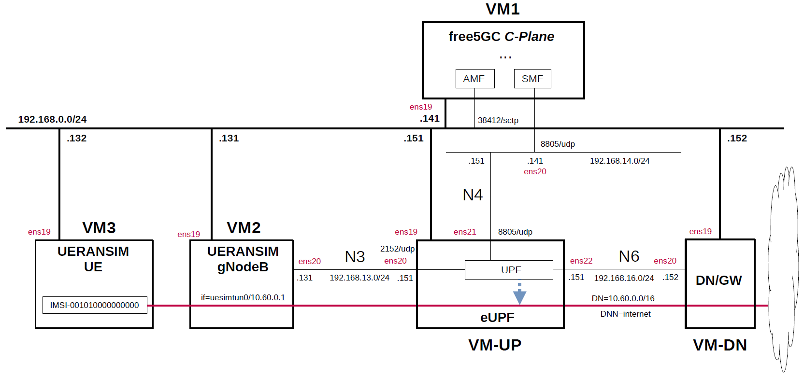

# free5GC 5GC & UERANSIM UE / RAN Sample Configuration - eUPF(eBPF/XDP UPF)
This describes a simple configuration for working free5GC and eUPF(eBPF/XDP UPF).
In particular, see [here](https://github.com/s5uishida/install_eupf) for eUPF.

---

### [Sample Configurations and Miscellaneous for Mobile Network](https://github.com/s5uishida/sample_config_misc_for_mobile_network)

---

<a id="toc"></a>

## Table of Contents

- [Overview of free5GC 5GC Simulation Mobile Network](#overview)
- [Changes in configuration files of free5GC 5GC, eUPF and UERANSIM UE / RAN](#changes)
  - [Changes in configuration files of free5GC 5GC C-Plane](#changes_cp)
  - [Changes in configuration files of eUPF](#changes_up)
  - [Changes in configuration files of UERANSIM UE / RAN](#changes_ueransim)
    - [Changes in configuration files of RAN](#changes_ran)
    - [Changes in configuration files of UE (IMSI-001010000000000)](#changes_ue)
- [Network settings of free5GC 5GC, eUPF and UERANSIM UE / RAN](#network_settings)
  - [Network settings of eUPF and Data Network Gateway](#network_settings_up)
- [Build free5GC, eUPF and UERANSIM](#build)
- [Run free5GC 5GC, eUPF and UERANSIM UE / RAN](#run)
  - [Run eUPF](#run_up)
  - [Run free5GC 5GC C-Plane](#run_cp)
  - [Run UERANSIM](#run_ueran)
    - [Start gNB](#start_gnb)
    - [Start UE](#start_ue)
- [Ping google.com](#ping)
  - [Case for going through DN 10.60.0.0/16](#ping_1)
- [Changelog (summary)](#changelog)

---

<a id="overview"></a>

## Overview of free5GC 5GC Simulation Mobile Network

This describes a simple configuration of C-Plane, eBPF/XDP UPF and Data Network Gateway for free5GC.
**Note that this configuration is implemented with Virtualbox VMs.**

The following minimum configuration was set as a condition.
- One UPF and Data Network Gateway
- One UE and one DNN

The built simulation environment is as follows.

</img>

The 5GC / eBPF/XDP UPF / UE / RAN used are as follows.
- 5GC - free5GC v3.4.0 (2024.02.17) - https://github.com/free5gc/free5gc
- eBPF/XDP UPF - eUPF v0.6.1 (2024.01.25) - https://github.com/edgecomllc/eupf
- UE / RAN - UERANSIM v3.2.6 (2024.03.08) - https://github.com/aligungr/UERANSIM

Each VMs are as follows.  
| VM | SW & Role | IP address | OS | CPU<br>(Min) | Memory<br>(Min) | HDD<br>(Min) |
| --- | --- | --- | --- | --- | --- | --- |
| VM1 | free5GC 5GC C-Plane | 192.168.0.141/24 | Ubuntu 22.04 | 1 | 2GB | 20GB |
| VM-UP | eUPF U-Plane | 192.168.0.151/24 | Ubuntu 22.04 | 1 | 2GB | 20GB |
| VM-DN | Data Network Gateway  | 192.168.0.152/24 | Ubuntu 22.04 | 1 | 1GB | 10GB |
| VM2 | UERANSIM RAN (gNodeB) | 192.168.0.131/24 | Ubuntu 22.04 | 1 | 1GB | 10GB |
| VM3 | UERANSIM UE | 192.168.0.132/24 | Ubuntu 22.04 | 1 | 1GB | 10GB |

The network interfaces of each VM are as follows.
| VM | Device | Network Adapter | IP address | Interface | XDP |
| --- | --- | --- | --- | --- | --- |
| VM1 | enp0s3 | NAT(default) | 10.0.2.15/24 | (VM default NW) | -- |
| | enp0s8 | Bridged Adapter | 192.168.0.141/24 | (Mgmt NW) | -- |
| | enp0s9 | NAT Network | 192.168.14.141/24 | N4 | -- |
| VM-UP | ~~enp0s3~~ | ~~NAT(default)~~ | ~~10.0.2.15/24~~ | ~~(VM default NW)~~ ***down*** | -- |
| | enp0s8 | Bridged Adapter | 192.168.0.151/24 | (Mgmt NW) | -- |
| | enp0s9 | NAT Network | 192.168.13.151/24 | N3 | x |
| | enp0s10 | NAT Network | 192.168.14.151/24 | N4 | -- |
| | enp0s16 | NAT Network | 192.168.16.151/24 | N6 | x |
| VM-DN | enp0s3 | NAT(default) | 10.0.2.15/24 | (VM default NW) | -- |
| | enp0s8 | Bridged Adapter | 192.168.0.152/24 | (Mgmt NW) | -- |
| | enp0s9 | NAT Network | 192.168.16.152/24 | N6, ***default GW for VM-UP*** | -- |
| VM2 | enp0s3 | NAT(default) | 10.0.2.15/24 | (VM default NW) | -- |
| | enp0s8 | Bridged Adapter | 192.168.0.131/24 | (Mgmt NW) | -- |
| | enp0s9 | NAT Network | 192.168.13.131/24 | N3 | -- |
| VM3 | enp0s3 | NAT(default) | 10.0.2.15/24 | (VM default NW) | -- |
| | enp0s8 | Bridged Adapter | 192.168.0.132/24 | (Mgmt NW) | -- |

NAT networks of Virtualbox  are as follows.
| Network Name | Network CIDR |
| --- | --- |
| N3 | 192.168.13.0/24 |
| N4 | 192.168.14.0/24 |
| N6 | 192.168.16.0/24 |


Subscriber Information (other information is the same) is as follows.  
**Note. Please select OP or OPc according to the setting of UERANSIM UE configuration file.**
| UE | IMSI | DNN | OP/OPc |
| --- | --- | --- | --- |
| UE | 001010000000000 | internet | OPc |

I registered these information with the free5GC WebUI.
In addition, [3GPP TS 35.208](https://www.3gpp.org/DynaReport/35208.htm) "4.3 Test Sets" is published by 3GPP as test data for the 3GPP authentication and key generation functions (MILENAGE).

The DN is as follows.
| DN | DNN | TUNnel interface of UE |
| --- | --- | --- |
| 10.60.0.0/16 | internet | uesimtun0 |

<a id="changes"></a>

## Changes in configuration files of free5GC 5GC, eUPF and UERANSIM UE / RAN

Please refer to the following for building free5GC, eUPF and UERANSIM respectively.
- free5GC v3.4.0 (2024.02.17) - https://free5gc.org/guide/
- eUPF v0.6.1 (2024.01.25) - https://github.com/s5uishida/install_eupf
- UERANSIM v3.2.6 (2024.03.08) - https://github.com/aligungr/UERANSIM/wiki/Installation

<a id="changes_cp"></a>

### Changes in configuration files of free5GC 5GC C-Plane

The combination of DNN and S-NSSAI parameters can be used in the logic that selects UPF as the connection destination by PFCP.

- DNN
- S-NSSAI

For the sake of simplicity, This time, only DNN will be changed. S-NSSAI of all UEs is fixed as `SST=1` and `SD=010203`.

- `free5gc/config/amfcfg.yaml`
```diff
--- amfcfg.yaml.orig    2024-03-24 17:44:26.586613478 +0900
+++ amfcfg.yaml 2024-03-24 17:54:43.098963522 +0900
@@ -5,7 +5,7 @@
 configuration:
   amfName: AMF # the name of this AMF
   ngapIpList:  # the IP list of N2 interfaces on this AMF
-    - 127.0.0.18
+    - 192.168.0.141
   ngapPort: 38412 # the SCTP port listened by NGAP
   sbi: # Service-based interface information
     scheme: http # the protocol for sbi (http or https)
@@ -24,18 +24,18 @@
   servedGuamiList: # Guami (Globally Unique AMF ID) list supported by this AMF
     # <GUAMI> = <MCC><MNC><AMF ID>
     - plmnId: # Public Land Mobile Network ID, <PLMN ID> = <MCC><MNC>
-        mcc: 208 # Mobile Country Code (3 digits string, digit: 0~9)
-        mnc: 93 # Mobile Network Code (2 or 3 digits string, digit: 0~9)
+        mcc: 001 # Mobile Country Code (3 digits string, digit: 0~9)
+        mnc: 01 # Mobile Network Code (2 or 3 digits string, digit: 0~9)
       amfId: cafe00 # AMF identifier (3 bytes hex string, range: 000000~FFFFFF)
   supportTaiList:  # the TAI (Tracking Area Identifier) list supported by this AMF
     - plmnId: # Public Land Mobile Network ID, <PLMN ID> = <MCC><MNC>
-        mcc: 208 # Mobile Country Code (3 digits string, digit: 0~9)
-        mnc: 93 # Mobile Network Code (2 or 3 digits string, digit: 0~9)
+        mcc: 001 # Mobile Country Code (3 digits string, digit: 0~9)
+        mnc: 01 # Mobile Network Code (2 or 3 digits string, digit: 0~9)
       tac: 000001 # Tracking Area Code (3 bytes hex string, range: 000000~FFFFFF)
   plmnSupportList: # the PLMNs (Public land mobile network) list supported by this AMF
     - plmnId: # Public Land Mobile Network ID, <PLMN ID> = <MCC><MNC>
-        mcc: 208 # Mobile Country Code (3 digits string, digit: 0~9)
-        mnc: 93 # Mobile Network Code (2 or 3 digits string, digit: 0~9)
+        mcc: 001 # Mobile Country Code (3 digits string, digit: 0~9)
+        mnc: 01 # Mobile Network Code (2 or 3 digits string, digit: 0~9)
       snssaiList: # the S-NSSAI (Single Network Slice Selection Assistance Information) list supported by this AMF
         - sst: 1 # Slice/Service Type (uinteger, range: 0~255)
           sd: 010203 # Slice Differentiator (3 bytes hex string, range: 000000~FFFFFF)
```
- `free5gc/config/ausfcfg.yaml`
```diff
--- ausfcfg.yaml.orig   2024-03-24 17:44:26.586613478 +0900
+++ ausfcfg.yaml        2024-03-24 17:54:54.683442170 +0900
@@ -16,8 +16,8 @@
   nrfUri: http://127.0.0.10:8000 # a valid URI of NRF
   nrfCertPem: cert/nrf.pem # NRF Certificate
   plmnSupportList: # the PLMNs (Public Land Mobile Network) list supported by this AUSF
-    - mcc: 208 # Mobile Country Code (3 digits string, digit: 0~9)
-      mnc: 93  # Mobile Network Code (2 or 3 digits string, digit: 0~9)
+    - mcc: 001 # Mobile Country Code (3 digits string, digit: 0~9)
+      mnc: 01  # Mobile Network Code (2 or 3 digits string, digit: 0~9)
     - mcc: 123 # Mobile Country Code (3 digits string, digit: 0~9)
       mnc: 45  # Mobile Network Code (2 or 3 digits string, digit: 0~9)
   groupId: ausfGroup001 # ID for the group of the AUSF
```
- `free5gc/config/nrfcfg.yaml`
```diff
--- nrfcfg.yaml.orig    2024-03-24 17:44:26.586613478 +0900
+++ nrfcfg.yaml 2024-03-24 17:55:10.259073431 +0900
@@ -15,8 +15,8 @@
       key: cert/nrf.key # NRF TLS Private key
     oauth: true
   DefaultPlmnId:
-    mcc: 208 # Mobile Country Code (3 digits string, digit: 0~9)
-    mnc: 93 # Mobile Network Code (2 or 3 digits string, digit: 0~9)
+    mcc: 001 # Mobile Country Code (3 digits string, digit: 0~9)
+    mnc: 01 # Mobile Network Code (2 or 3 digits string, digit: 0~9)
   serviceNameList: # the SBI services provided by this NRF, refer to TS 29.510
     - nnrf-nfm # Nnrf_NFManagement service
     - nnrf-disc # Nnrf_NFDiscovery service
```
- `free5gc/config/nssfcfg.yaml`
```diff
--- nssfcfg.yaml.orig   2024-03-24 17:44:26.586613478 +0900
+++ nssfcfg.yaml        2024-03-24 17:55:25.660684149 +0900
@@ -18,12 +18,12 @@
   nrfUri: http://127.0.0.10:8000 # a valid URI of NRF
   nrfCertPem: cert/nrf.pem # NRF Certificate
   supportedPlmnList: # the PLMNs (Public land mobile network) list supported by this NSSF
-    - mcc: 208 # Mobile Country Code (3 digits string, digit: 0~9)
-      mnc: 93 # Mobile Network Code (2 or 3 digits string, digit: 0~9)
+    - mcc: 001 # Mobile Country Code (3 digits string, digit: 0~9)
+      mnc: 01 # Mobile Network Code (2 or 3 digits string, digit: 0~9)
   supportedNssaiInPlmnList: # Supported S-NSSAI List for each PLMN
     - plmnId: # Public Land Mobile Network ID, <PLMN ID> = <MCC><MNC>
-        mcc: 208 # Mobile Country Code (3 digits string, digit: 0~9)
-        mnc: 93 # Mobile Network Code (2 or 3 digits string, digit: 0~9)
+        mcc: 001 # Mobile Country Code (3 digits string, digit: 0~9)
+        mnc: 01 # Mobile Network Code (2 or 3 digits string, digit: 0~9)
       supportedSnssaiList: # Supported S-NSSAIs of the PLMN
         - sst: 1 # Slice/Service Type (uinteger, range: 0~255)
           sd: 010203 # Slice Differentiator (3 bytes hex string, range: 000000~FFFFFF)
```
- `free5gc/config/smfcfg.yaml`
```diff
--- smfcfg.yaml.orig    2024-03-24 17:44:26.586613478 +0900
+++ smfcfg.yaml 2024-03-28 21:23:47.750479543 +0900
@@ -34,22 +34,22 @@
             ipv4: 8.8.8.8
             ipv6: 2001:4860:4860::8888
   plmnList: # the list of PLMN IDs that this SMF belongs to (optional, remove this key when unnecessary)
-    - mcc: 208 # Mobile Country Code (3 digits string, digit: 0~9)
-      mnc: 93 # Mobile Network Code (2 or 3 digits string, digit: 0~9)
+    - mcc: 001 # Mobile Country Code (3 digits string, digit: 0~9)
+      mnc: 01 # Mobile Network Code (2 or 3 digits string, digit: 0~9)
   locality: area1 # Name of the location where a set of AMF, SMF, PCF and UPFs are located
   pfcp: # the IP address of N4 interface on this SMF (PFCP)
     # addr config is deprecated in smf config v1.0.3, please use the following config
-    nodeID: 127.0.0.1 # the Node ID of this SMF
-    listenAddr: 127.0.0.1 # the IP/FQDN of N4 interface on this SMF (PFCP)
-    externalAddr: 127.0.0.1 # the IP/FQDN of N4 interface on this SMF (PFCP)
+    nodeID: 192.168.14.141 # the Node ID of this SMF
+    listenAddr: 192.168.14.141 # the IP/FQDN of N4 interface on this SMF (PFCP)
+    externalAddr: 192.168.14.141 # the IP/FQDN of N4 interface on this SMF (PFCP)
   userplaneInformation: # list of userplane information
     upNodes: # information of userplane node (AN or UPF)
       gNB1: # the name of the node
         type: AN # the type of the node (AN or UPF)
       UPF: # the name of the node
         type: UPF # the type of the node (AN or UPF)
-        nodeID: 127.0.0.8 # the Node ID of this UPF
-        addr: 127.0.0.8 # the IP/FQDN of N4 interface on this UPF (PFCP)
+        nodeID: 192.168.14.151 # the Node ID of this UPF
+        addr: 192.168.14.151 # the IP/FQDN of N4 interface on this UPF (PFCP)
         sNssaiUpfInfos: # S-NSSAI information list for this UPF
           - sNssai: # S-NSSAI (Single Network Slice Selection Assistance Information)
               sst: 1 # Slice/Service Type (uinteger, range: 0~255)
@@ -72,7 +72,7 @@
         interfaces: # Interface list for this UPF
           - interfaceType: N3 # the type of the interface (N3 or N9)
             endpoints: # the IP address of this N3/N9 interface on this UPF
-              - 127.0.0.8
+              - 192.168.13.151
             networkInstances:  # Data Network Name (DNN)
               - internet
     links: # the topology graph of userplane, A and B represent the two nodes of each link
@@ -90,8 +90,9 @@
     maxRetryTimes: 3 # the max number of retransmission
   nrfUri: http://127.0.0.10:8000 # a valid URI of NRF
   nrfCertPem: cert/nrf.pem # NRF Certificate
-  #urrPeriod: 10 # default usage report period in seconds
-  #urrThreshold: 1000 # default usage report threshold in bytes
+  urrPeriod: 10 # default usage report period in seconds
+  urrThreshold: 1000 # default usage report threshold in bytes
+  ulcl: false
 
 logger: # log output setting
   enable: true # true or false
```

<a id="changes_up"></a>

### Changes in configuration files of eUPF

See [here](https://github.com/s5uishida/install_eupf#create-configuration-file) for the original file.

- `eupf/config.yml`  
There is no change.

<a id="changes_ueransim"></a>

### Changes in configuration files of UERANSIM UE / RAN

<a id="changes_ran"></a>

#### Changes in configuration files of RAN

- `UERANSIM/config/free5gc-gnb.yaml`
```diff
--- free5gc-gnb.yaml.orig       2023-12-02 06:14:20.000000000 +0900
+++ free5gc-gnb.yaml    2024-03-24 16:59:41.400899800 +0900
@@ -1,17 +1,17 @@
-mcc: '208'          # Mobile Country Code value
-mnc: '93'           # Mobile Network Code value (2 or 3 digits)
+mcc: '001'          # Mobile Country Code value
+mnc: '01'           # Mobile Network Code value (2 or 3 digits)
 
 nci: '0x000000010'  # NR Cell Identity (36-bit)
 idLength: 32        # NR gNB ID length in bits [22...32]
 tac: 1              # Tracking Area Code
 
-linkIp: 127.0.0.1   # gNB's local IP address for Radio Link Simulation (Usually same with local IP)
-ngapIp: 127.0.0.1   # gNB's local IP address for N2 Interface (Usually same with local IP)
-gtpIp: 127.0.0.1    # gNB's local IP address for N3 Interface (Usually same with local IP)
+linkIp: 192.168.0.131   # gNB's local IP address for Radio Link Simulation (Usually same with local IP)
+ngapIp: 192.168.0.131   # gNB's local IP address for N2 Interface (Usually same with local IP)
+gtpIp: 192.168.13.131    # gNB's local IP address for N3 Interface (Usually same with local IP)
 
 # List of AMF address information
 amfConfigs:
-  - address: 127.0.0.1
+  - address: 192.168.0.141
     port: 38412
 
 # List of supported S-NSSAIs by this gNB
```

<a id="changes_ue"></a>

#### Changes in configuration files of UE (IMSI-001010000000000)

- `UERANSIM/config/free5gc-ue.yaml`
```diff
--- free5gc-ue.yaml.orig        2024-03-02 20:20:59.000000000 +0900
+++ free5gc-ue.yaml     2024-03-24 17:02:26.271746257 +0900
@@ -1,9 +1,9 @@
 # IMSI number of the UE. IMSI = [MCC|MNC|MSISDN] (In total 15 digits)
-supi: 'imsi-208930000000001'
+supi: 'imsi-001010000000000'
 # Mobile Country Code value of HPLMN
-mcc: '208'
+mcc: '001'
 # Mobile Network Code value of HPLMN (2 or 3 digits)
-mnc: '93'
+mnc: '01'
 # SUCI Protection Scheme : 0 for Null-scheme, 1 for Profile A and 2 for Profile B
 protectionScheme: 0
 # Home Network Public Key for protecting with SUCI Profile A
@@ -28,7 +28,7 @@
 
 # List of gNB IP addresses for Radio Link Simulation
 gnbSearchList:
-  - 127.0.0.1
+  - 192.168.0.131
 
 # UAC Access Identities Configuration
 uacAic:
```

<a id="network_settings"></a>

## Network settings of free5GC 5GC, eUPF and UERANSIM UE / RAN

<a id="network_settings_up"></a>

### Network settings of eUPF and Data Network Gateway

See [this1](https://github.com/s5uishida/install_eupf#setup-eupf-on-vm-up) and [this2](https://github.com/s5uishida/install_eupf#setup-data-network-gateway-on-vm-dn).

<a id="build"></a>

## Build free5GC, eUPF and UERANSIM

Please refer to the following for building free5GC, eUPF and UERANSIM respectively.
- free5GC v3.4.0 (2024.02.17) - https://free5gc.org/guide/
- eUPF v0.6.1 (2024.01.25) - https://github.com/s5uishida/install_eupf
- UERANSIM v3.2.6 (2024.03.08) - https://github.com/aligungr/UERANSIM/wiki/Installation

Install MongoDB on free5GC 5GC C-Plane machine.
[MongoDB Compass](https://www.mongodb.com/products/compass) is a convenient tool to look at the MongoDB database.

**Note. The installation guide also includes instructions on building the latest committed version.**

<a id="run"></a>

## Run free5GC 5GC, eUPF and UERANSIM UE / RAN

First run eUPF, then the 5GC and UERANSIM (UE & RAN implementation).

<a id="run_up"></a>

### Run eUPF

See [this](https://github.com/s5uishida/install_eupf#run-eupf-on-vm-up).

<a id="run_cp"></a>

### Run free5GC 5GC C-Plane

Next, run free5GC 5GC C-Plane.
Create the following shell script and run it.
```bash
#!/usr/bin/env bash

PID_LIST=()

NF_LIST="nrf amf smf udr pcf udm nssf ausf chf"

export GIN_MODE=release

for NF in ${NF_LIST}; do
    ./bin/${NF} &
    PID_LIST+=($!)
    sleep 1
done

function terminate()
{
    sudo kill -SIGTERM ${PID_LIST[${#PID_LIST[@]}-2]} ${PID_LIST[${#PID_LIST[@]}-1]}
    sleep 2
}

trap terminate SIGINT
wait ${PID_LIST}
```
The PFCP association log between eUPF and free5GC SMF is as follows.
```
2024/03/24 19:25:14 INF Got Association Setup Request from: 192.168.14.141. 

2024/03/24 19:25:14 INF 
Association Setup Request:
  Node ID: 192.168.14.141
  Recovery Time: 2024-03-24 19:25:05 +0900 JST

2024/03/24 19:25:14 INF Saving new association: &{ID:192.168.14.141 Addr:192.168.14.141 NextSessionID:1 NextSequenceID:1 Sessions:map[] HeartbeatChannel:0xc0000b48a0 FailedHeartbeats:0 HeartbeatsActive:false Mutex:{state:0 sema:0}}
```

<a id="run_ueran"></a>

### Run UERANSIM

Here, the case of UE (IMSI-001010000000000) & RAN is described.
First, do an NG Setup between gNodeB and 5GC, then register the UE with 5GC and establish a PDU session.

Please refer to the following for usage of UERANSIM.

https://github.com/aligungr/UERANSIM/wiki/Usage


<a id="start_gnb"></a>

#### Start gNB

Start gNB as follows.
```
# ./nr-gnb -c ../config/free5gc-gnb.yaml
UERANSIM v3.2.6
[2024-03-24 19:26:03.397] [sctp] [info] Trying to establish SCTP connection... (192.168.0.141:38412)
[2024-03-24 19:26:03.400] [sctp] [info] SCTP connection established (192.168.0.141:38412)
[2024-03-24 19:26:03.401] [sctp] [debug] SCTP association setup ascId[12]
[2024-03-24 19:26:03.401] [ngap] [debug] Sending NG Setup Request
[2024-03-24 19:26:03.403] [ngap] [debug] NG Setup Response received
[2024-03-24 19:26:03.403] [ngap] [info] NG Setup procedure is successful
```
The free5GC C-Plane log when executed is as follows.
```
2024-03-24T19:26:03.372332460+09:00 [INFO][AMF][Ngap] [AMF] SCTP Accept from: 192.168.0.131:36528
2024-03-24T19:26:03.373024834+09:00 [INFO][AMF][Ngap] Create a new NG connection for: 192.168.0.131:36528
2024-03-24T19:26:03.373666062+09:00 [INFO][AMF][Ngap][ran_addr:192.168.0.131:36528] Handle NGSetupRequest
2024-03-24T19:26:03.373697648+09:00 [INFO][AMF][Ngap][ran_addr:192.168.0.131:36528] Send NG-Setup response
```

<a id="start_ue"></a>

#### Start UE

Start UE as follows. This will register the UE with 5GC and establish a PDU session.
```
# ./nr-ue -c ../config/free5gc-ue.yaml
UERANSIM v3.2.6
[2024-03-24 19:26:35.957] [nas] [info] UE switches to state [MM-DEREGISTERED/PLMN-SEARCH]
[2024-03-24 19:26:35.957] [rrc] [debug] New signal detected for cell[1], total [1] cells in coverage
[2024-03-24 19:26:35.957] [nas] [info] Selected plmn[001/01]
[2024-03-24 19:26:35.957] [rrc] [info] Selected cell plmn[001/01] tac[1] category[SUITABLE]
[2024-03-24 19:26:35.957] [nas] [info] UE switches to state [MM-DEREGISTERED/PS]
[2024-03-24 19:26:35.957] [nas] [info] UE switches to state [MM-DEREGISTERED/NORMAL-SERVICE]
[2024-03-24 19:26:35.958] [nas] [debug] Initial registration required due to [MM-DEREG-NORMAL-SERVICE]
[2024-03-24 19:26:35.958] [nas] [debug] UAC access attempt is allowed for identity[0], category[MO_sig]
[2024-03-24 19:26:35.959] [nas] [debug] Sending Initial Registration
[2024-03-24 19:26:35.959] [rrc] [debug] Sending RRC Setup Request
[2024-03-24 19:26:35.959] [nas] [info] UE switches to state [MM-REGISTER-INITIATED]
[2024-03-24 19:26:35.959] [rrc] [info] RRC connection established
[2024-03-24 19:26:35.959] [rrc] [info] UE switches to state [RRC-CONNECTED]
[2024-03-24 19:26:35.960] [nas] [info] UE switches to state [CM-CONNECTED]
[2024-03-24 19:26:36.015] [nas] [debug] Authentication Request received
[2024-03-24 19:26:36.015] [nas] [debug] Received SQN [00000000007F]
[2024-03-24 19:26:36.015] [nas] [debug] SQN-MS [000000000000]
[2024-03-24 19:26:36.042] [nas] [debug] Security Mode Command received
[2024-03-24 19:26:36.042] [nas] [debug] Selected integrity[2] ciphering[0]
[2024-03-24 19:26:36.216] [nas] [debug] Registration accept received
[2024-03-24 19:26:36.216] [nas] [info] UE switches to state [MM-REGISTERED/NORMAL-SERVICE]
[2024-03-24 19:26:36.216] [nas] [debug] Sending Registration Complete
[2024-03-24 19:26:36.216] [nas] [info] Initial Registration is successful
[2024-03-24 19:26:36.217] [nas] [debug] Sending PDU Session Establishment Request
[2024-03-24 19:26:36.217] [nas] [debug] UAC access attempt is allowed for identity[0], category[MO_sig]
[2024-03-24 19:26:36.425] [nas] [debug] Configuration Update Command received
[2024-03-24 19:26:36.589] [nas] [debug] PDU Session Establishment Accept received
[2024-03-24 19:26:36.594] [nas] [info] PDU Session establishment is successful PSI[1]
[2024-03-24 19:26:36.617] [app] [info] Connection setup for PDU session[1] is successful, TUN interface[uesimtun0, 10.60.0.1] is up.
```
The free5GC C-Plane log when executed is as follows.
```
2024-03-24T19:26:35.878918059+09:00 [INFO][AMF][Ngap][ran_addr:192.168.0.131:36528] Handle InitialUEMessage
2024-03-24T19:26:35.879151433+09:00 [INFO][AMF][Ngap][amf_ue_ngap_id:RU:1,AU:1(3GPP)][ran_addr:192.168.0.131:36528] New RanUe [RanUeNgapID:1][AmfUeNgapID:1]
2024-03-24T19:26:35.879341725+09:00 [INFO][AMF][Ngap][ran_addr:192.168.0.131:36528] 5GSMobileIdentity ["SUCI":"suci-0-001-01-0000-0-0-0000000000", err: <nil>]
2024-03-24T19:26:35.880067477+09:00 [INFO][AMF][CTX] New AmfUe [supi:][guti:00101cafe0000000001]
2024-03-24T19:26:35.880267463+09:00 [INFO][AMF][Gmm] Handle event[Gmm Message], transition from [Deregistered] to [Deregistered]
2024-03-24T19:26:35.880457905+09:00 [INFO][AMF][Gmm][amf_ue_ngap_id:RU:1,AU:1(3GPP)][supi:SUPI:] Handle Registration Request
2024-03-24T19:26:35.880599877+09:00 [INFO][AMF][Gmm][amf_ue_ngap_id:RU:1,AU:1(3GPP)][supi:SUPI:] RegistrationType: Initial Registration
2024-03-24T19:26:35.880752114+09:00 [INFO][AMF][Gmm][amf_ue_ngap_id:RU:1,AU:1(3GPP)][supi:SUPI:] MobileIdentity5GS: SUCI[suci-0-001-01-0000-0-0-0000000000]
2024-03-24T19:26:35.880915136+09:00 [INFO][AMF][Gmm] Handle event[Start Authentication], transition from [Deregistered] to [Authentication]
2024-03-24T19:26:35.881101928+09:00 [INFO][AMF][Gmm][amf_ue_ngap_id:RU:1,AU:1(3GPP)][supi:SUPI:] Authentication procedure
2024-03-24T19:26:35.881892608+09:00 [INFO][NRF][Token] In HTTPAccessTokenRequest
2024-03-24T19:26:35.882243831+09:00 [INFO][NRF][Token] Handle AccessTokenRequest
2024-03-24T19:26:35.882305875+09:00 [INFO][NRF][Token] In AccessTokenProcedure
2024-03-24T19:26:35.883743543+09:00 [WARN][NRF][Token] Certificate verify: x509: certificate signed by unknown authority (possibly because of "x509: invalid signature: parent certificate cannot sign this kind of certificate" while trying to verify candidate authority certificate "free5gc")
2024-03-24T19:26:35.886524195+09:00 [INFO][NRF][GIN] | 200 |       127.0.0.1 | POST    | /oauth2/token |
2024-03-24T19:26:35.887670700+09:00 [INFO][NRF][DISC] Handle NFDiscoveryRequest
2024-03-24T19:26:35.888513538+09:00 [INFO][NRF][GIN] | 200 |       127.0.0.1 | GET     | /nnrf-disc/v1/nf-instances?requester-nf-type=AMF&target-nf-type=AUSF |
2024-03-24T19:26:35.889117468+09:00 [INFO][NRF][Token] In HTTPAccessTokenRequest
2024-03-24T19:26:35.889327855+09:00 [INFO][NRF][Token] Handle AccessTokenRequest
2024-03-24T19:26:35.889474053+09:00 [INFO][NRF][Token] In AccessTokenProcedure
2024-03-24T19:26:35.890619316+09:00 [WARN][NRF][Token] Certificate verify: x509: certificate signed by unknown authority (possibly because of "x509: invalid signature: parent certificate cannot sign this kind of certificate" while trying to verify candidate authority certificate "free5gc")
2024-03-24T19:26:35.893700534+09:00 [INFO][NRF][GIN] | 200 |       127.0.0.1 | POST    | /oauth2/token |
2024-03-24T19:26:35.895263359+09:00 [INFO][AUSF][UeAuth] HandleUeAuthPostRequest
2024-03-24T19:26:35.895795842+09:00 [INFO][AUSF][UeAuth] Serving network authorized
2024-03-24T19:26:35.896396759+09:00 [INFO][NRF][Token] In HTTPAccessTokenRequest
2024-03-24T19:26:35.896737585+09:00 [INFO][NRF][Token] Handle AccessTokenRequest
2024-03-24T19:26:35.897054131+09:00 [INFO][NRF][Token] In AccessTokenProcedure
2024-03-24T19:26:35.897930479+09:00 [WARN][NRF][Token] Certificate verify: x509: certificate signed by unknown authority (possibly because of "x509: invalid signature: parent certificate cannot sign this kind of certificate" while trying to verify candidate authority certificate "free5gc")
2024-03-24T19:26:35.900584036+09:00 [INFO][NRF][GIN] | 200 |       127.0.0.1 | POST    | /oauth2/token |
2024-03-24T19:26:35.901645644+09:00 [INFO][NRF][DISC] Handle NFDiscoveryRequest
2024-03-24T19:26:35.902806878+09:00 [INFO][NRF][GIN] | 200 |       127.0.0.1 | GET     | /nnrf-disc/v1/nf-instances?requester-nf-type=AUSF&service-names=nudm-ueau&target-nf-type=UDM |
2024-03-24T19:26:35.903438557+09:00 [INFO][NRF][Token] In HTTPAccessTokenRequest
2024-03-24T19:26:35.903639818+09:00 [INFO][NRF][Token] Handle AccessTokenRequest
2024-03-24T19:26:35.903778869+09:00 [INFO][NRF][Token] In AccessTokenProcedure
2024-03-24T19:26:35.904561196+09:00 [WARN][NRF][Token] Certificate verify: x509: certificate signed by unknown authority (possibly because of "x509: invalid signature: parent certificate cannot sign this kind of certificate" while trying to verify candidate authority certificate "free5gc")
2024-03-24T19:26:35.908146526+09:00 [INFO][NRF][GIN] | 200 |       127.0.0.1 | POST    | /oauth2/token |
2024-03-24T19:26:35.911029207+09:00 [INFO][UDM][UEAU] Handle GenerateAuthDataRequest
2024-03-24T19:26:35.912160262+09:00 [INFO][NRF][Token] In HTTPAccessTokenRequest
2024-03-24T19:26:35.912472672+09:00 [INFO][NRF][Token] Handle AccessTokenRequest
2024-03-24T19:26:35.912801300+09:00 [INFO][NRF][Token] In AccessTokenProcedure
2024-03-24T19:26:35.913972343+09:00 [WARN][NRF][Token] Certificate verify: x509: certificate signed by unknown authority (possibly because of "x509: invalid signature: parent certificate cannot sign this kind of certificate" while trying to verify candidate authority certificate "free5gc")
2024-03-24T19:26:35.917078526+09:00 [INFO][NRF][GIN] | 200 |       127.0.0.1 | POST    | /oauth2/token |
2024-03-24T19:26:35.917475685+09:00 [INFO][UDM][Suci] suciPart: [suci 0 001 01 0000 0 0 0000000000]
2024-03-24T19:26:35.917660004+09:00 [INFO][UDM][Suci] scheme 0
2024-03-24T19:26:35.917823756+09:00 [INFO][UDM][Suci] SUPI type is IMSI
http://127.0.0.10:8000
2024-03-24T19:26:35.918338910+09:00 [INFO][NRF][Token] In HTTPAccessTokenRequest
2024-03-24T19:26:35.918403367+09:00 [INFO][NRF][Token] Handle AccessTokenRequest
2024-03-24T19:26:35.918416711+09:00 [INFO][NRF][Token] In AccessTokenProcedure
2024-03-24T19:26:35.919485446+09:00 [WARN][NRF][Token] Certificate verify: x509: certificate signed by unknown authority (possibly because of "x509: invalid signature: parent certificate cannot sign this kind of certificate" while trying to verify candidate authority certificate "free5gc")
2024-03-24T19:26:35.921903338+09:00 [INFO][NRF][GIN] | 200 |       127.0.0.1 | POST    | /oauth2/token |
2024-03-24T19:26:35.922926371+09:00 [INFO][NRF][DISC] Handle NFDiscoveryRequest
2024-03-24T19:26:35.923709199+09:00 [INFO][NRF][GIN] | 200 |       127.0.0.1 | GET     | /nnrf-disc/v1/nf-instances?requester-nf-type=UDM&target-nf-type=UDR |
2024-03-24T19:26:35.925339959+09:00 [INFO][UDR][DataRepo] Handle QueryAuthSubsData
2024-03-24T19:26:35.926758682+09:00 [INFO][UDR][GIN] | 200 |       127.0.0.1 | GET     | /nudr-dr/v1/subscription-data/imsi-001010000000000/authentication-data/authentication-subscription |
2024-03-24T19:26:35.927712465+09:00 [INFO][UDM][UEAU] Nil Op
2024-03-24T19:26:35.928851206+09:00 [INFO][UDR][DataRepo] Handle ModifyAuthentication
2024-03-24T19:26:35.930745427+09:00 [INFO][UDR][GIN] | 204 |       127.0.0.1 | PATCH   | /nudr-dr/v1/subscription-data/imsi-001010000000000/authentication-data/authentication-subscription |
2024-03-24T19:26:35.931124351+09:00 [INFO][UDM][GIN] | 200 |       127.0.0.1 | POST    | /nudm-ueau/v1/suci-0-001-01-0000-0-0-0000000000/security-information/generate-auth-data |
2024-03-24T19:26:35.931654550+09:00 [INFO][AUSF][UeAuth] Add SuciSupiPair (suci-0-001-01-0000-0-0-0000000000, imsi-001010000000000) to map.
2024-03-24T19:26:35.931830352+09:00 [INFO][AUSF][UeAuth] Use 5G AKA auth method
2024-03-24T19:26:35.931850060+09:00 [INFO][AUSF][5gAka] XresStar = 3135373935313432663962663731383336346262316536643738613739656337
2024-03-24T19:26:35.932245084+09:00 [INFO][AUSF][GIN] | 201 |       127.0.0.1 | POST    | /nausf-auth/v1/ue-authentications |
2024-03-24T19:26:35.932631951+09:00 [INFO][AMF][Gmm][amf_ue_ngap_id:RU:1,AU:1(3GPP)][supi:SUPI:] Send Authentication Request
2024-03-24T19:26:35.932696386+09:00 [INFO][AMF][Ngap][amf_ue_ngap_id:RU:1,AU:1(3GPP)][ran_addr:192.168.0.131:36528] Send Downlink Nas Transport
2024-03-24T19:26:35.933052348+09:00 [INFO][AMF][Gmm][amf_ue_ngap_id:RU:1,AU:1(3GPP)][supi:SUPI:] Start T3560 timer
2024-03-24T19:26:35.934729201+09:00 [INFO][AMF][Ngap][ran_addr:192.168.0.131:36528] Handle UplinkNASTransport
2024-03-24T19:26:35.934960095+09:00 [INFO][AMF][Ngap][amf_ue_ngap_id:RU:1,AU:1(3GPP)][ran_addr:192.168.0.131:36528] Handle UplinkNASTransport (RAN UE NGAP ID: 1)
2024-03-24T19:26:35.935169528+09:00 [INFO][AMF][Gmm] Handle event[Gmm Message], transition from [Authentication] to [Authentication]
2024-03-24T19:26:35.935323711+09:00 [INFO][AMF][Gmm][amf_ue_ngap_id:RU:1,AU:1(3GPP)][supi:SUPI:] Handle Authentication Response
2024-03-24T19:26:35.935471854+09:00 [INFO][AMF][Gmm][amf_ue_ngap_id:RU:1,AU:1(3GPP)][supi:SUPI:] Stop T3560 timer
2024-03-24T19:26:35.936294434+09:00 [INFO][NRF][Token] In HTTPAccessTokenRequest
2024-03-24T19:26:35.936585478+09:00 [INFO][NRF][Token] Handle AccessTokenRequest
2024-03-24T19:26:35.936609273+09:00 [INFO][NRF][Token] In AccessTokenProcedure
2024-03-24T19:26:35.937755777+09:00 [WARN][NRF][Token] Certificate verify: x509: certificate signed by unknown authority (possibly because of "x509: invalid signature: parent certificate cannot sign this kind of certificate" while trying to verify candidate authority certificate "free5gc")
2024-03-24T19:26:35.940953362+09:00 [INFO][NRF][GIN] | 200 |       127.0.0.1 | POST    | /oauth2/token |
2024-03-24T19:26:35.942512684+09:00 [INFO][AUSF][5gAka] Auth5gAkaComfirmRequest
2024-03-24T19:26:35.942962135+09:00 [INFO][AUSF][5gAka] res*: 3135373935313432663962663731383336346262316536643738613739656337
Xres*: 3135373935313432663962663731383336346262316536643738613739656337
2024-03-24T19:26:35.943484433+09:00 [INFO][AUSF][5gAka] 5G AKA confirmation succeeded
2024-03-24T19:26:35.944157901+09:00 [INFO][NRF][Token] In HTTPAccessTokenRequest
2024-03-24T19:26:35.944280663+09:00 [INFO][NRF][Token] Handle AccessTokenRequest
2024-03-24T19:26:35.944297329+09:00 [INFO][NRF][Token] In AccessTokenProcedure
2024-03-24T19:26:35.944947326+09:00 [WARN][NRF][Token] Certificate verify: x509: certificate signed by unknown authority (possibly because of "x509: invalid signature: parent certificate cannot sign this kind of certificate" while trying to verify candidate authority certificate "free5gc")
2024-03-24T19:26:35.948402674+09:00 [INFO][NRF][GIN] | 200 |       127.0.0.1 | POST    | /oauth2/token |
2024-03-24T19:26:35.949911013+09:00 [INFO][UDM][UEAU] Handle ConfirmAuthDataRequest
2024-03-24T19:26:35.950676540+09:00 [INFO][NRF][Token] In HTTPAccessTokenRequest
2024-03-24T19:26:35.950913244+09:00 [INFO][NRF][Token] Handle AccessTokenRequest
2024-03-24T19:26:35.951089011+09:00 [INFO][NRF][Token] In AccessTokenProcedure
2024-03-24T19:26:35.952308234+09:00 [WARN][NRF][Token] Certificate verify: x509: certificate signed by unknown authority (possibly because of "x509: invalid signature: parent certificate cannot sign this kind of certificate" while trying to verify candidate authority certificate "free5gc")
2024-03-24T19:26:35.955493820+09:00 [INFO][NRF][GIN] | 200 |       127.0.0.1 | POST    | /oauth2/token |
2024-03-24T19:26:35.956984501+09:00 [INFO][UDR][DataRepo] Handle CreateAuthenticationStatus
2024-03-24T19:26:35.958200146+09:00 [INFO][UDR][GIN] | 204 |       127.0.0.1 | PUT     | /nudr-dr/v1/subscription-data/imsi-001010000000000/authentication-data/authentication-status |
2024-03-24T19:26:35.958714659+09:00 [INFO][UDM][GIN] | 201 |       127.0.0.1 | POST    | /nudm-ueau/v1/imsi-001010000000000/auth-events |
2024-03-24T19:26:35.959275014+09:00 [INFO][AUSF][GIN] | 200 |       127.0.0.1 | PUT     | /nausf-auth/v1/ue-authentications/suci-0-001-01-0000-0-0-0000000000/5g-aka-confirmation |
2024-03-24T19:26:35.959608412+09:00 [INFO][AMF][Gmm] Handle event[Authentication Success], transition from [Authentication] to [SecurityMode]
2024-03-24T19:26:35.959678754+09:00 [INFO][AMF][Gmm][amf_ue_ngap_id:RU:1,AU:1(3GPP)][supi:SUPI:imsi-001010000000000] Send Security Mode Command
2024-03-24T19:26:35.959717827+09:00 [INFO][AMF][Ngap][amf_ue_ngap_id:RU:1,AU:1(3GPP)][ran_addr:192.168.0.131:36528] Send Downlink Nas Transport
2024-03-24T19:26:35.960053130+09:00 [INFO][AMF][Gmm][amf_ue_ngap_id:RU:1,AU:1(3GPP)][supi:SUPI:imsi-001010000000000] Start T3560 timer
2024-03-24T19:26:35.961722644+09:00 [INFO][AMF][Ngap][ran_addr:192.168.0.131:36528] Handle UplinkNASTransport
2024-03-24T19:26:35.961938818+09:00 [INFO][AMF][Ngap][amf_ue_ngap_id:RU:1,AU:1(3GPP)][ran_addr:192.168.0.131:36528] Handle UplinkNASTransport (RAN UE NGAP ID: 1)
2024-03-24T19:26:35.962163057+09:00 [INFO][AMF][Gmm] Handle event[Gmm Message], transition from [SecurityMode] to [SecurityMode]
2024-03-24T19:26:35.962316868+09:00 [INFO][AMF][Gmm][amf_ue_ngap_id:RU:1,AU:1(3GPP)][supi:SUPI:imsi-001010000000000] Handle Security Mode Complete
2024-03-24T19:26:35.962465483+09:00 [INFO][AMF][Gmm][amf_ue_ngap_id:RU:1,AU:1(3GPP)][supi:SUPI:imsi-001010000000000] Stop T3560 timer
2024-03-24T19:26:35.962650698+09:00 [INFO][AMF][Gmm] Handle event[SecurityMode Success], transition from [SecurityMode] to [ContextSetup]
2024-03-24T19:26:35.962793644+09:00 [INFO][AMF][Gmm][amf_ue_ngap_id:RU:1,AU:1(3GPP)][supi:SUPI:imsi-001010000000000] Handle InitialRegistration
2024-03-24T19:26:35.963663580+09:00 [INFO][NRF][Token] In HTTPAccessTokenRequest
2024-03-24T19:26:35.963925651+09:00 [INFO][NRF][Token] Handle AccessTokenRequest
2024-03-24T19:26:35.964089774+09:00 [INFO][NRF][Token] In AccessTokenProcedure
2024-03-24T19:26:35.965486839+09:00 [WARN][NRF][Token] Certificate verify: x509: certificate signed by unknown authority (possibly because of "x509: invalid signature: parent certificate cannot sign this kind of certificate" while trying to verify candidate authority certificate "free5gc")
2024-03-24T19:26:35.968196018+09:00 [INFO][NRF][GIN] | 200 |       127.0.0.1 | POST    | /oauth2/token |
2024-03-24T19:26:35.969258634+09:00 [INFO][NRF][DISC] Handle NFDiscoveryRequest
2024-03-24T19:26:35.970482975+09:00 [INFO][NRF][GIN] | 200 |       127.0.0.1 | GET     | /nnrf-disc/v1/nf-instances?requester-nf-type=AMF&supi=imsi-001010000000000&target-nf-type=UDM |
2024-03-24T19:26:35.971101404+09:00 [INFO][NRF][Token] In HTTPAccessTokenRequest
2024-03-24T19:26:35.971310982+09:00 [INFO][NRF][Token] Handle AccessTokenRequest
2024-03-24T19:26:35.971458767+09:00 [INFO][NRF][Token] In AccessTokenProcedure
2024-03-24T19:26:35.972916750+09:00 [WARN][NRF][Token] Certificate verify: x509: certificate signed by unknown authority (possibly because of "x509: invalid signature: parent certificate cannot sign this kind of certificate" while trying to verify candidate authority certificate "free5gc")
2024-03-24T19:26:35.976484422+09:00 [INFO][NRF][GIN] | 200 |       127.0.0.1 | POST    | /oauth2/token |
2024-03-24T19:26:35.977917179+09:00 [INFO][UDM][SDM] Handle GetNssai
2024-03-24T19:26:35.978745004+09:00 [INFO][NRF][Token] In HTTPAccessTokenRequest
2024-03-24T19:26:35.979033381+09:00 [INFO][NRF][Token] Handle AccessTokenRequest
2024-03-24T19:26:35.979176521+09:00 [INFO][NRF][Token] In AccessTokenProcedure
2024-03-24T19:26:35.980434324+09:00 [WARN][NRF][Token] Certificate verify: x509: certificate signed by unknown authority (possibly because of "x509: invalid signature: parent certificate cannot sign this kind of certificate" while trying to verify candidate authority certificate "free5gc")
2024-03-24T19:26:35.983511189+09:00 [INFO][NRF][GIN] | 200 |       127.0.0.1 | POST    | /oauth2/token |
2024-03-24T19:26:35.984895421+09:00 [INFO][UDR][DataRepo] Handle QueryAmData
2024-03-24T19:26:35.985738344+09:00 [INFO][UDR][GIN] | 200 |       127.0.0.1 | GET     | /nudr-dr/v1/subscription-data/imsi-001010000000000/00101/provisioned-data/am-data |
2024-03-24T19:26:35.986108928+09:00 [INFO][UDM][GIN] | 200 |       127.0.0.1 | GET     | /nudm-sdm/v1/imsi-001010000000000/nssai?plmn-id=%7B%22mcc%22%3A%22001%22%2C%22mnc%22%3A%2201%22%7D |
2024-03-24T19:26:35.986567810+09:00 [INFO][AMF][Gmm] RequestedNssai: &{Iei:47 Len:5 Buffer:[4 1 1 2 3]}
2024-03-24T19:26:35.986616344+09:00 [INFO][AMF][Gmm][amf_ue_ngap_id:RU:1,AU:1(3GPP)][supi:SUPI:imsi-001010000000000] RequestedNssai - ServingSnssai: &{Sst:1 Sd:010203}, HomeSnssai: <nil>
2024-03-24T19:26:35.987801335+09:00 [INFO][NRF][Token] In HTTPAccessTokenRequest
2024-03-24T19:26:35.988062263+09:00 [INFO][NRF][Token] Handle AccessTokenRequest
2024-03-24T19:26:35.988216033+09:00 [INFO][NRF][Token] In AccessTokenProcedure
2024-03-24T19:26:35.989537327+09:00 [WARN][NRF][Token] Certificate verify: x509: certificate signed by unknown authority (possibly because of "x509: invalid signature: parent certificate cannot sign this kind of certificate" while trying to verify candidate authority certificate "free5gc")
2024-03-24T19:26:35.992255070+09:00 [INFO][NRF][GIN] | 200 |       127.0.0.1 | POST    | /oauth2/token |
2024-03-24T19:26:35.993267313+09:00 [INFO][NRF][DISC] Handle NFDiscoveryRequest
2024-03-24T19:26:35.994534118+09:00 [INFO][NRF][GIN] | 200 |       127.0.0.1 | GET     | /nnrf-disc/v1/nf-instances?requester-nf-type=AMF&supi=imsi-001010000000000&target-nf-type=UDM |
2024-03-24T19:26:35.995481262+09:00 [INFO][NRF][Token] In HTTPAccessTokenRequest
2024-03-24T19:26:35.995698690+09:00 [INFO][NRF][Token] Handle AccessTokenRequest
2024-03-24T19:26:35.995887690+09:00 [INFO][NRF][Token] In AccessTokenProcedure
2024-03-24T19:26:35.998986320+09:00 [WARN][NRF][Token] Certificate verify: x509: certificate signed by unknown authority (possibly because of "x509: invalid signature: parent certificate cannot sign this kind of certificate" while trying to verify candidate authority certificate "free5gc")
2024-03-24T19:26:36.003981846+09:00 [INFO][NRF][GIN] | 200 |       127.0.0.1 | POST    | /oauth2/token |
2024-03-24T19:26:36.005776391+09:00 [INFO][UDM][UECM] Handle RegistrationAmf3gppAccess
2024-03-24T19:26:36.005976301+09:00 [INFO][UDM][UECM] UEID: imsi-001010000000000
2024-03-24T19:26:36.006751493+09:00 [INFO][NRF][Token] In HTTPAccessTokenRequest
2024-03-24T19:26:36.007084470+09:00 [INFO][NRF][Token] Handle AccessTokenRequest
2024-03-24T19:26:36.007279010+09:00 [INFO][NRF][Token] In AccessTokenProcedure
2024-03-24T19:26:36.008444853+09:00 [WARN][NRF][Token] Certificate verify: x509: certificate signed by unknown authority (possibly because of "x509: invalid signature: parent certificate cannot sign this kind of certificate" while trying to verify candidate authority certificate "free5gc")
2024-03-24T19:26:36.011566737+09:00 [INFO][NRF][GIN] | 200 |       127.0.0.1 | POST    | /oauth2/token |
2024-03-24T19:26:36.013099550+09:00 [INFO][UDR][DataRepo] Handle CreateAmfContext3gpp
2024-03-24T19:26:36.014400873+09:00 [INFO][UDR][GIN] | 204 |       127.0.0.1 | PUT     | /nudr-dr/v1/subscription-data/imsi-001010000000000/context-data/amf-3gpp-access |
2024-03-24T19:26:36.014702680+09:00 [INFO][UDM][GIN] | 201 |       127.0.0.1 | PUT     | /nudm-uecm/v1/imsi-001010000000000/registrations/amf-3gpp-access |
2024-03-24T19:26:36.015581766+09:00 [INFO][NRF][Token] In HTTPAccessTokenRequest
2024-03-24T19:26:36.015930803+09:00 [INFO][NRF][Token] Handle AccessTokenRequest
2024-03-24T19:26:36.016123770+09:00 [INFO][NRF][Token] In AccessTokenProcedure
2024-03-24T19:26:36.017246410+09:00 [WARN][NRF][Token] Certificate verify: x509: certificate signed by unknown authority (possibly because of "x509: invalid signature: parent certificate cannot sign this kind of certificate" while trying to verify candidate authority certificate "free5gc")
2024-03-24T19:26:36.020747383+09:00 [INFO][NRF][GIN] | 200 |       127.0.0.1 | POST    | /oauth2/token |
2024-03-24T19:26:36.022042849+09:00 [INFO][UDM][SDM] Handle GetAmData
2024-03-24T19:26:36.022896804+09:00 [INFO][NRF][Token] In HTTPAccessTokenRequest
2024-03-24T19:26:36.023185631+09:00 [INFO][NRF][Token] Handle AccessTokenRequest
2024-03-24T19:26:36.023343759+09:00 [INFO][NRF][Token] In AccessTokenProcedure
2024-03-24T19:26:36.024430577+09:00 [WARN][NRF][Token] Certificate verify: x509: certificate signed by unknown authority (possibly because of "x509: invalid signature: parent certificate cannot sign this kind of certificate" while trying to verify candidate authority certificate "free5gc")
2024-03-24T19:26:36.027374151+09:00 [INFO][NRF][GIN] | 200 |       127.0.0.1 | POST    | /oauth2/token |
2024-03-24T19:26:36.029771620+09:00 [INFO][UDR][DataRepo] Handle QueryAmData
2024-03-24T19:26:36.030433584+09:00 [INFO][UDR][GIN] | 200 |       127.0.0.1 | GET     | /nudr-dr/v1/subscription-data/imsi-001010000000000/00101/provisioned-data/am-data?supported-features=%7B%22mcc%22%3A%22001%22%2C%22mnc%22%3A%2201%22%7D |
2024-03-24T19:26:36.032081720+09:00 [INFO][UDM][GIN] | 200 |       127.0.0.1 | GET     | /nudm-sdm/v1/imsi-001010000000000/am-data?plmn-id=%7B%22mcc%22%3A%22001%22%2C%22mnc%22%3A%2201%22%7D |
2024-03-24T19:26:36.035347853+09:00 [INFO][NRF][Token] In HTTPAccessTokenRequest
2024-03-24T19:26:36.035623716+09:00 [INFO][NRF][Token] Handle AccessTokenRequest
2024-03-24T19:26:36.035815072+09:00 [INFO][NRF][Token] In AccessTokenProcedure
2024-03-24T19:26:36.037277783+09:00 [WARN][NRF][Token] Certificate verify: x509: certificate signed by unknown authority (possibly because of "x509: invalid signature: parent certificate cannot sign this kind of certificate" while trying to verify candidate authority certificate "free5gc")
2024-03-24T19:26:36.040894942+09:00 [INFO][NRF][GIN] | 200 |       127.0.0.1 | POST    | /oauth2/token |
2024-03-24T19:26:36.042218534+09:00 [INFO][UDM][SDM] Handle GetSmfSelectData
2024-03-24T19:26:36.042917748+09:00 [INFO][NRF][Token] In HTTPAccessTokenRequest
2024-03-24T19:26:36.043178430+09:00 [INFO][NRF][Token] Handle AccessTokenRequest
2024-03-24T19:26:36.043332483+09:00 [INFO][NRF][Token] In AccessTokenProcedure
2024-03-24T19:26:36.044387936+09:00 [WARN][NRF][Token] Certificate verify: x509: certificate signed by unknown authority (possibly because of "x509: invalid signature: parent certificate cannot sign this kind of certificate" while trying to verify candidate authority certificate "free5gc")
2024-03-24T19:26:36.047605333+09:00 [INFO][NRF][GIN] | 200 |       127.0.0.1 | POST    | /oauth2/token |
2024-03-24T19:26:36.048872476+09:00 [INFO][UDR][DataRepo] Handle QuerySmfSelectData
2024-03-24T19:26:36.049820059+09:00 [INFO][UDR][GIN] | 200 |       127.0.0.1 | GET     | /nudr-dr/v1/subscription-data/imsi-001010000000000/00101/provisioned-data/smf-selection-subscription-data |
2024-03-24T19:26:36.050250771+09:00 [INFO][UDM][GIN] | 200 |       127.0.0.1 | GET     | /nudm-sdm/v1/imsi-001010000000000/smf-select-data?plmn-id=%7B%22mcc%22%3A%22001%22%2C%22mnc%22%3A%2201%22%7D |
2024-03-24T19:26:36.051108067+09:00 [INFO][NRF][Token] In HTTPAccessTokenRequest
2024-03-24T19:26:36.051438312+09:00 [INFO][NRF][Token] Handle AccessTokenRequest
2024-03-24T19:26:36.051676913+09:00 [INFO][NRF][Token] In AccessTokenProcedure
2024-03-24T19:26:36.052945494+09:00 [WARN][NRF][Token] Certificate verify: x509: certificate signed by unknown authority (possibly because of "x509: invalid signature: parent certificate cannot sign this kind of certificate" while trying to verify candidate authority certificate "free5gc")
2024-03-24T19:26:36.056658361+09:00 [INFO][NRF][GIN] | 200 |       127.0.0.1 | POST    | /oauth2/token |
2024-03-24T19:26:36.057898116+09:00 [INFO][UDM][SDM] Handle GetUeContextInSmfData
2024-03-24T19:26:36.058742569+09:00 [INFO][NRF][Token] In HTTPAccessTokenRequest
2024-03-24T19:26:36.059041778+09:00 [INFO][NRF][Token] Handle AccessTokenRequest
2024-03-24T19:26:36.059212185+09:00 [INFO][NRF][Token] In AccessTokenProcedure
2024-03-24T19:26:36.060380523+09:00 [WARN][NRF][Token] Certificate verify: x509: certificate signed by unknown authority (possibly because of "x509: invalid signature: parent certificate cannot sign this kind of certificate" while trying to verify candidate authority certificate "free5gc")
2024-03-24T19:26:36.063554026+09:00 [INFO][NRF][GIN] | 200 |       127.0.0.1 | POST    | /oauth2/token |
2024-03-24T19:26:36.064828526+09:00 [INFO][UDR][DataRepo] Handle QuerySmfRegList
2024-03-24T19:26:36.065551298+09:00 [INFO][UDR][GIN] | 200 |       127.0.0.1 | GET     | /nudr-dr/v1/subscription-data/imsi-001010000000000/context-data/smf-registrations |
2024-03-24T19:26:36.066119118+09:00 [INFO][UDM][GIN] | 200 |       127.0.0.1 | GET     | /nudm-sdm/v1/imsi-001010000000000/ue-context-in-smf-data |
2024-03-24T19:26:36.067271619+09:00 [INFO][NRF][Token] In HTTPAccessTokenRequest
2024-03-24T19:26:36.067688586+09:00 [INFO][NRF][Token] Handle AccessTokenRequest
2024-03-24T19:26:36.067864858+09:00 [INFO][NRF][Token] In AccessTokenProcedure
2024-03-24T19:26:36.069214664+09:00 [WARN][NRF][Token] Certificate verify: x509: certificate signed by unknown authority (possibly because of "x509: invalid signature: parent certificate cannot sign this kind of certificate" while trying to verify candidate authority certificate "free5gc")
2024-03-24T19:26:36.072570424+09:00 [INFO][NRF][GIN] | 200 |       127.0.0.1 | POST    | /oauth2/token |
2024-03-24T19:26:36.073922894+09:00 [INFO][UDM][SDM] Handle Subscribe
2024-03-24T19:26:36.074856017+09:00 [INFO][NRF][Token] In HTTPAccessTokenRequest
2024-03-24T19:26:36.075270532+09:00 [INFO][NRF][Token] Handle AccessTokenRequest
2024-03-24T19:26:36.075425944+09:00 [INFO][NRF][Token] In AccessTokenProcedure
2024-03-24T19:26:36.076523050+09:00 [WARN][NRF][Token] Certificate verify: x509: certificate signed by unknown authority (possibly because of "x509: invalid signature: parent certificate cannot sign this kind of certificate" while trying to verify candidate authority certificate "free5gc")
2024-03-24T19:26:36.080100501+09:00 [INFO][NRF][GIN] | 200 |       127.0.0.1 | POST    | /oauth2/token |
2024-03-24T19:26:36.081580767+09:00 [INFO][UDR][DataRepo] Handle CreateSdmSubscriptions
2024-03-24T19:26:36.081842483+09:00 [INFO][UDR][GIN] | 201 |       127.0.0.1 | POST    | /nudr-dr/v1/subscription-data/imsi-001010000000000/context-data/sdm-subscriptions |
2024-03-24T19:26:36.082239070+09:00 [INFO][UDM][GIN] | 201 |       127.0.0.1 | POST    | /nudm-sdm/v1/imsi-001010000000000/sdm-subscriptions |
2024-03-24T19:26:36.083380776+09:00 [INFO][NRF][Token] In HTTPAccessTokenRequest
2024-03-24T19:26:36.083785655+09:00 [INFO][NRF][Token] Handle AccessTokenRequest
2024-03-24T19:26:36.083979088+09:00 [INFO][NRF][Token] In AccessTokenProcedure
2024-03-24T19:26:36.086482127+09:00 [WARN][NRF][Token] Certificate verify: x509: certificate signed by unknown authority (possibly because of "x509: invalid signature: parent certificate cannot sign this kind of certificate" while trying to verify candidate authority certificate "free5gc")
2024-03-24T19:26:36.089119652+09:00 [INFO][NRF][GIN] | 200 |       127.0.0.1 | POST    | /oauth2/token |
2024-03-24T19:26:36.091670779+09:00 [INFO][NRF][DISC] Handle NFDiscoveryRequest
2024-03-24T19:26:36.093306994+09:00 [INFO][NRF][GIN] | 200 |       127.0.0.1 | GET     | /nnrf-disc/v1/nf-instances?preferred-locality=area1&requester-nf-type=AMF&supi=imsi-001010000000000&target-nf-type=PCF |
2024-03-24T19:26:36.093859707+09:00 [INFO][NRF][Token] In HTTPAccessTokenRequest
2024-03-24T19:26:36.094255019+09:00 [INFO][NRF][Token] Handle AccessTokenRequest
2024-03-24T19:26:36.094408958+09:00 [INFO][NRF][Token] In AccessTokenProcedure
2024-03-24T19:26:36.095739504+09:00 [WARN][NRF][Token] Certificate verify: x509: certificate signed by unknown authority (possibly because of "x509: invalid signature: parent certificate cannot sign this kind of certificate" while trying to verify candidate authority certificate "free5gc")
2024-03-24T19:26:36.099092356+09:00 [INFO][NRF][GIN] | 200 |       127.0.0.1 | POST    | /oauth2/token |
2024-03-24T19:26:36.101421583+09:00 [INFO][PCF][AmPol] Handle AM Policy Create Request
2024-03-24T19:26:36.102133842+09:00 [INFO][NRF][Token] In HTTPAccessTokenRequest
2024-03-24T19:26:36.102448574+09:00 [INFO][NRF][Token] Handle AccessTokenRequest
2024-03-24T19:26:36.102467311+09:00 [INFO][NRF][Token] In AccessTokenProcedure
2024-03-24T19:26:36.103827742+09:00 [WARN][NRF][Token] Certificate verify: x509: certificate signed by unknown authority (possibly because of "x509: invalid signature: parent certificate cannot sign this kind of certificate" while trying to verify candidate authority certificate "free5gc")
2024-03-24T19:26:36.106390088+09:00 [INFO][NRF][GIN] | 200 |       127.0.0.1 | POST    | /oauth2/token |
2024-03-24T19:26:36.107578243+09:00 [INFO][NRF][DISC] Handle NFDiscoveryRequest
2024-03-24T19:26:36.108567187+09:00 [INFO][NRF][GIN] | 200 |       127.0.0.1 | GET     | /nnrf-disc/v1/nf-instances?requester-nf-type=PCF&target-nf-type=UDR |
2024-03-24T19:26:36.109103136+09:00 [INFO][NRF][Token] In HTTPAccessTokenRequest
2024-03-24T19:26:36.109344000+09:00 [INFO][NRF][Token] Handle AccessTokenRequest
2024-03-24T19:26:36.109517850+09:00 [INFO][NRF][Token] In AccessTokenProcedure
2024-03-24T19:26:36.110666552+09:00 [WARN][NRF][Token] Certificate verify: x509: certificate signed by unknown authority (possibly because of "x509: invalid signature: parent certificate cannot sign this kind of certificate" while trying to verify candidate authority certificate "free5gc")
2024-03-24T19:26:36.113710420+09:00 [INFO][NRF][GIN] | 200 |       127.0.0.1 | POST    | /oauth2/token |
2024-03-24T19:26:36.115086497+09:00 [INFO][UDR][DataRepo] Handle PolicyDataUesUeIdAmDataGet
2024-03-24T19:26:36.115768749+09:00 [INFO][UDR][GIN] | 200 |       127.0.0.1 | GET     | /nudr-dr/v1/policy-data/ues/imsi-001010000000000/am-data |
2024-03-24T19:26:36.116873399+09:00 [INFO][NRF][Token] In HTTPAccessTokenRequest
2024-03-24T19:26:36.117198532+09:00 [INFO][NRF][Token] Handle AccessTokenRequest
2024-03-24T19:26:36.117474790+09:00 [INFO][NRF][Token] In AccessTokenProcedure
2024-03-24T19:26:36.118646236+09:00 [WARN][NRF][Token] Certificate verify: x509: certificate signed by unknown authority (possibly because of "x509: invalid signature: parent certificate cannot sign this kind of certificate" while trying to verify candidate authority certificate "free5gc")
2024-03-24T19:26:36.121140910+09:00 [INFO][NRF][GIN] | 200 |       127.0.0.1 | POST    | /oauth2/token |
2024-03-24T19:26:36.122131911+09:00 [INFO][NRF][DISC] Handle NFDiscoveryRequest
2024-03-24T19:26:36.123334370+09:00 [INFO][NRF][GIN] | 200 |       127.0.0.1 | GET     | /nnrf-disc/v1/nf-instances?guami=%7B%22plmnId%22%3A%7B%22mcc%22%3A%22001%22%2C%22mnc%22%3A%2201%22%7D%2C%22amfId%22%3A%22cafe00%22%7D&requester-nf-type=PCF&target-nf-type=AMF |
2024-03-24T19:26:36.123915125+09:00 [INFO][NRF][Token] In HTTPAccessTokenRequest
2024-03-24T19:26:36.124471825+09:00 [INFO][NRF][Token] Handle AccessTokenRequest
2024-03-24T19:26:36.124618079+09:00 [INFO][NRF][Token] In AccessTokenProcedure
2024-03-24T19:26:36.125833900+09:00 [WARN][NRF][Token] Certificate verify: x509: certificate signed by unknown authority (possibly because of "x509: invalid signature: parent certificate cannot sign this kind of certificate" while trying to verify candidate authority certificate "free5gc")
2024-03-24T19:26:36.129217806+09:00 [INFO][NRF][GIN] | 200 |       127.0.0.1 | POST    | /oauth2/token |
2024-03-24T19:26:36.130789928+09:00 [INFO][AMF][Comm] Handle AMF Status Change Subscribe Request
2024-03-24T19:26:36.131091285+09:00 [INFO][AMF][Comm] new AMF Status Subscription[1]
2024-03-24T19:26:36.131317837+09:00 [INFO][AMF][GIN] | 201 |       127.0.0.1 | POST    | /namf-comm/v1/subscriptions |
2024-03-24T19:26:36.131783090+09:00 [INFO][PCF][GIN] | 201 |       127.0.0.1 | POST    | /npcf-am-policy-control/v1/policies |
2024-03-24T19:26:36.132414787+09:00 [INFO][AMF][Gmm][amf_ue_ngap_id:RU:1,AU:1(3GPP)][supi:SUPI:imsi-001010000000000] Send Registration Accept
2024-03-24T19:26:36.132597038+09:00 [INFO][AMF][Ngap][amf_ue_ngap_id:RU:1,AU:1(3GPP)][ran_addr:192.168.0.131:36528] Send Initial Context Setup Request
2024-03-24T19:26:36.133770934+09:00 [INFO][AMF][Gmm][amf_ue_ngap_id:RU:1,AU:1(3GPP)][supi:SUPI:imsi-001010000000000] Start T3550 timer
2024-03-24T19:26:36.134622338+09:00 [INFO][AMF][Ngap][ran_addr:192.168.0.131:36528] Handle InitialContextSetupResponse
2024-03-24T19:26:36.134791142+09:00 [INFO][AMF][Ngap][amf_ue_ngap_id:RU:1,AU:1(3GPP)][ran_addr:192.168.0.131:36528] Handle InitialContextSetupResponse (RAN UE NGAP ID: 1)
2024-03-24T19:26:36.341646077+09:00 [INFO][AMF][Ngap][ran_addr:192.168.0.131:36528] Handle UplinkNASTransport
2024-03-24T19:26:36.341912737+09:00 [INFO][AMF][Ngap][amf_ue_ngap_id:RU:1,AU:1(3GPP)][ran_addr:192.168.0.131:36528] Handle UplinkNASTransport (RAN UE NGAP ID: 1)
2024-03-24T19:26:36.342194570+09:00 [INFO][AMF][Gmm] Handle event[Gmm Message], transition from [ContextSetup] to [ContextSetup]
2024-03-24T19:26:36.342291903+09:00 [INFO][AMF][Gmm][amf_ue_ngap_id:RU:1,AU:1(3GPP)][supi:SUPI:imsi-001010000000000] Handle Registration Complete
2024-03-24T19:26:36.342479026+09:00 [INFO][AMF][Gmm][amf_ue_ngap_id:RU:1,AU:1(3GPP)][supi:SUPI:imsi-001010000000000] Stop T3550 timer
2024-03-24T19:26:36.342702977+09:00 [INFO][AMF][Gmm][amf_ue_ngap_id:RU:1,AU:1(3GPP)][supi:SUPI:imsi-001010000000000] Send Configuration Update Command
2024-03-24T19:26:36.342913808+09:00 [INFO][AMF][Ngap][amf_ue_ngap_id:RU:1,AU:1(3GPP)][ran_addr:192.168.0.131:36528] Send Downlink Nas Transport
2024-03-24T19:26:36.343649275+09:00 [INFO][AMF][Gmm] Handle event[ContextSetup Success], transition from [ContextSetup] to [Registered]
2024-03-24T19:26:36.345101575+09:00 [INFO][AMF][Ngap][ran_addr:192.168.0.131:36528] Handle UplinkNASTransport
2024-03-24T19:26:36.345207941+09:00 [INFO][AMF][Ngap][amf_ue_ngap_id:RU:1,AU:1(3GPP)][ran_addr:192.168.0.131:36528] Handle UplinkNASTransport (RAN UE NGAP ID: 1)
2024-03-24T19:26:36.345482452+09:00 [INFO][AMF][Gmm] Handle event[Gmm Message], transition from [Registered] to [Registered]
2024-03-24T19:26:36.345575808+09:00 [INFO][AMF][Gmm][amf_ue_ngap_id:RU:1,AU:1(3GPP)][supi:SUPI:imsi-001010000000000] Handle UL NAS Transport
2024-03-24T19:26:36.345774441+09:00 [INFO][AMF][Gmm][amf_ue_ngap_id:RU:1,AU:1(3GPP)][supi:SUPI:imsi-001010000000000] Transport 5GSM Message to SMF
2024-03-24T19:26:36.345943442+09:00 [INFO][AMF][Gmm][amf_ue_ngap_id:RU:1,AU:1(3GPP)][supi:SUPI:imsi-001010000000000] Select SMF [snssai: {Sst:1 Sd:010203}, dnn: internet]
2024-03-24T19:26:36.347833049+09:00 [INFO][NRF][Token] In HTTPAccessTokenRequest
2024-03-24T19:26:36.348162267+09:00 [INFO][NRF][Token] Handle AccessTokenRequest
2024-03-24T19:26:36.348262985+09:00 [INFO][NRF][Token] In AccessTokenProcedure
2024-03-24T19:26:36.350304146+09:00 [WARN][NRF][Token] Certificate verify: x509: certificate signed by unknown authority (possibly because of "x509: invalid signature: parent certificate cannot sign this kind of certificate" while trying to verify candidate authority certificate "free5gc")
2024-03-24T19:26:36.353167598+09:00 [INFO][NRF][GIN] | 200 |       127.0.0.1 | POST    | /oauth2/token |
2024-03-24T19:26:36.354199307+09:00 [INFO][NRF][DISC] Handle NFDiscoveryRequest
2024-03-24T19:26:36.355091034+09:00 [INFO][NRF][GIN] | 200 |       127.0.0.1 | GET     | /nnrf-disc/v1/nf-instances?requester-nf-type=AMF&target-nf-type=NSSF |
2024-03-24T19:26:36.355566770+09:00 [INFO][NRF][Token] In HTTPAccessTokenRequest
2024-03-24T19:26:36.355783563+09:00 [INFO][NRF][Token] Handle AccessTokenRequest
2024-03-24T19:26:36.355877499+09:00 [INFO][NRF][Token] In AccessTokenProcedure
2024-03-24T19:26:36.357175904+09:00 [WARN][NRF][Token] Certificate verify: x509: certificate signed by unknown authority (possibly because of "x509: invalid signature: parent certificate cannot sign this kind of certificate" while trying to verify candidate authority certificate "free5gc")
2024-03-24T19:26:36.360364803+09:00 [INFO][NRF][GIN] | 200 |       127.0.0.1 | POST    | /oauth2/token |
2024-03-24T19:26:36.361845861+09:00 [INFO][NSSF][NsSel] Handle NSSelectionGet
2024-03-24T19:26:36.362495549+09:00 [INFO][NSSF][GIN] | 200 |       127.0.0.1 | GET     | /nnssf-nsselection/v1/network-slice-information?nf-id=ebae9275-053c-4f2e-beb7-4c1c67a41034&nf-type=AMF&slice-info-request-for-pdu-session=%7B%22sNssai%22%3A%7B%22sst%22%3A1%2C%22sd%22%3A%22010203%22%7D%2C%22roamingIndication%22%3A%22NON_ROAMING%22%7D |
2024-03-24T19:26:36.363385813+09:00 [INFO][NRF][Token] In HTTPAccessTokenRequest
2024-03-24T19:26:36.363613798+09:00 [INFO][NRF][Token] Handle AccessTokenRequest
2024-03-24T19:26:36.363738188+09:00 [INFO][NRF][Token] In AccessTokenProcedure
2024-03-24T19:26:36.365138950+09:00 [WARN][NRF][Token] Certificate verify: x509: certificate signed by unknown authority (possibly because of "x509: invalid signature: parent certificate cannot sign this kind of certificate" while trying to verify candidate authority certificate "free5gc")
2024-03-24T19:26:36.367944214+09:00 [INFO][NRF][GIN] | 200 |       127.0.0.1 | POST    | /oauth2/token |
2024-03-24T19:26:36.368840960+09:00 [INFO][NRF][DISC] Handle NFDiscoveryRequest
2024-03-24T19:26:36.370299476+09:00 [INFO][NRF][GIN] | 200 |       127.0.0.1 | GET     | /nnrf-disc/v1/nf-instances?dnn=internet&preferred-locality=area1&requester-nf-type=AMF&service-names=nsmf-pdusession&snssais=%7B%22sst%22%3A1%2C%22sd%22%3A%22010203%22%7D&target-nf-type=SMF&target-plmn-list=%7B%22mcc%22%3A%22001%22%2C%22mnc%22%3A%2201%22%7D |
2024-03-24T19:26:36.371053584+09:00 [INFO][NRF][Token] In HTTPAccessTokenRequest
2024-03-24T19:26:36.373097973+09:00 [INFO][NRF][Token] Handle AccessTokenRequest
2024-03-24T19:26:36.373198747+09:00 [INFO][NRF][Token] In AccessTokenProcedure
2024-03-24T19:26:36.374571417+09:00 [WARN][NRF][Token] Certificate verify: x509: certificate signed by unknown authority (possibly because of "x509: invalid signature: parent certificate cannot sign this kind of certificate" while trying to verify candidate authority certificate "free5gc")
2024-03-24T19:26:36.377870338+09:00 [INFO][NRF][GIN] | 200 |       127.0.0.1 | POST    | /oauth2/token |
2024-03-24T19:26:36.379782386+09:00 [INFO][SMF][PduSess] Receive Create SM Context Request
2024-03-24T19:26:36.380507989+09:00 [INFO][SMF][PduSess] In HandlePDUSessionSMContextCreate
2024-03-24T19:26:36.380717066+09:00 [INFO][SMF][CTX] UrrPeriod: 10s
2024-03-24T19:26:36.380880848+09:00 [INFO][SMF][CTX] UrrThreshold: 1000
2024-03-24T19:26:36.381678005+09:00 [INFO][NRF][Token] In HTTPAccessTokenRequest
2024-03-24T19:26:36.382168050+09:00 [INFO][NRF][Token] Handle AccessTokenRequest
2024-03-24T19:26:36.382316037+09:00 [INFO][NRF][Token] In AccessTokenProcedure
2024-03-24T19:26:36.383437101+09:00 [WARN][NRF][Token] Certificate verify: x509: certificate signed by unknown authority (possibly because of "x509: invalid signature: parent certificate cannot sign this kind of certificate" while trying to verify candidate authority certificate "free5gc")
2024-03-24T19:26:36.386118836+09:00 [INFO][NRF][GIN] | 200 |       127.0.0.1 | POST    | /oauth2/token |
2024-03-24T19:26:36.387140999+09:00 [INFO][NRF][DISC] Handle NFDiscoveryRequest
2024-03-24T19:26:36.388249594+09:00 [INFO][NRF][GIN] | 200 |       127.0.0.1 | GET     | /nnrf-disc/v1/nf-instances?requester-nf-type=SMF&target-nf-type=UDM |
2024-03-24T19:26:36.388673061+09:00 [INFO][SMF][PduSess][pdu_session_id:1][supi:imsi-001010000000000] Send NF Discovery Serving UDM Successfully
2024-03-24T19:26:36.389290601+09:00 [INFO][NRF][Token] In HTTPAccessTokenRequest
2024-03-24T19:26:36.389499598+09:00 [INFO][NRF][Token] Handle AccessTokenRequest
2024-03-24T19:26:36.389647705+09:00 [INFO][NRF][Token] In AccessTokenProcedure
2024-03-24T19:26:36.390629856+09:00 [WARN][NRF][Token] Certificate verify: x509: certificate signed by unknown authority (possibly because of "x509: invalid signature: parent certificate cannot sign this kind of certificate" while trying to verify candidate authority certificate "free5gc")
2024-03-24T19:26:36.393911711+09:00 [INFO][NRF][GIN] | 200 |       127.0.0.1 | POST    | /oauth2/token |
2024-03-24T19:26:36.395339300+09:00 [INFO][UDM][SDM] Handle GetSmData
2024-03-24T19:26:36.396233251+09:00 [INFO][NRF][Token] In HTTPAccessTokenRequest
2024-03-24T19:26:36.396440111+09:00 [INFO][NRF][Token] Handle AccessTokenRequest
2024-03-24T19:26:36.396585523+09:00 [INFO][NRF][Token] In AccessTokenProcedure
2024-03-24T19:26:36.397775578+09:00 [WARN][NRF][Token] Certificate verify: x509: certificate signed by unknown authority (possibly because of "x509: invalid signature: parent certificate cannot sign this kind of certificate" while trying to verify candidate authority certificate "free5gc")
2024-03-24T19:26:36.400781591+09:00 [INFO][NRF][GIN] | 200 |       127.0.0.1 | POST    | /oauth2/token |
2024-03-24T19:26:36.401258751+09:00 [INFO][UDM][SDM] getSmDataProcedure: SUPI[imsi-001010000000000] PLMNID[00101] DNN[internet] SNssai[{"sst":1,"sd":"010203"}]
2024-03-24T19:26:36.402518146+09:00 [INFO][UDR][DataRepo] Handle QuerySmData
2024-03-24T19:26:36.403506850+09:00 [INFO][UDR][GIN] | 200 |       127.0.0.1 | GET     | /nudr-dr/v1/subscription-data/imsi-001010000000000/00101/provisioned-data/sm-data?single-nssai=%7B%22sst%22%3A1%2C%22sd%22%3A%22010203%22%7D |
2024-03-24T19:26:36.404129273+09:00 [INFO][UDM][GIN] | 200 |       127.0.0.1 | GET     | /nudm-sdm/v1/imsi-001010000000000/sm-data?dnn=internet&plmn-id=%7B%22mcc%22%3A%22001%22%2C%22mnc%22%3A%2201%22%7D&single-nssai=%7B%22sst%22%3A1%2C%22sd%22%3A%22010203%22%7D |
2024-03-24T19:26:36.404642689+09:00 [INFO][SMF][GSM] In HandlePDUSessionEstablishmentRequest
2024-03-24T19:26:36+09:00 [INFO][NAS][Convert] ProtocolOrContainerList:  [0xc000308f20 0xc000308f40]
2024-03-24T19:26:36.404736708+09:00 [INFO][SMF][GSM] Protocol Configuration Options
2024-03-24T19:26:36.404775125+09:00 [INFO][SMF][GSM] &{[0xc000308f20 0xc000308f40]}
2024-03-24T19:26:36.404807092+09:00 [INFO][SMF][GSM] Didn't Implement container type IPAddressAllocationViaNASSignallingUL
2024-03-24T19:26:36.405493964+09:00 [INFO][NRF][Token] In HTTPAccessTokenRequest
2024-03-24T19:26:36.405799568+09:00 [INFO][NRF][Token] Handle AccessTokenRequest
2024-03-24T19:26:36.406052291+09:00 [INFO][NRF][Token] In AccessTokenProcedure
2024-03-24T19:26:36.407119861+09:00 [WARN][NRF][Token] Certificate verify: x509: certificate signed by unknown authority (possibly because of "x509: invalid signature: parent certificate cannot sign this kind of certificate" while trying to verify candidate authority certificate "free5gc")
2024-03-24T19:26:36.409738721+09:00 [INFO][NRF][GIN] | 200 |       127.0.0.1 | POST    | /oauth2/token |
2024-03-24T19:26:36.410786121+09:00 [INFO][NRF][DISC] Handle NFDiscoveryRequest
2024-03-24T19:26:36.412097415+09:00 [INFO][NRF][GIN] | 200 |       127.0.0.1 | GET     | /nnrf-disc/v1/nf-instances?requester-nf-type=SMF&target-nf-instance-id=ebae9275-053c-4f2e-beb7-4c1c67a41034&target-nf-type=AMF |
2024-03-24T19:26:36.412563749+09:00 [INFO][SMF][Consumer] SendNFDiscoveryServingAMF ok
2024-03-24T19:26:36.412936803+09:00 [INFO][SMF][CTX] Allocated UE IP address: 10.60.0.1
2024-03-24T19:26:36.413131500+09:00 [INFO][SMF][CTX] Selected UPF: UPF
2024-03-24T19:26:36.413282963+09:00 [INFO][SMF][PduSess][pdu_session_id:1][supi:imsi-001010000000000] Allocated PDUAdress[10.60.0.1]
2024-03-24T19:26:36.414139857+09:00 [INFO][NRF][Token] In HTTPAccessTokenRequest
2024-03-24T19:26:36.414381720+09:00 [INFO][NRF][Token] Handle AccessTokenRequest
2024-03-24T19:26:36.414589770+09:00 [INFO][NRF][Token] In AccessTokenProcedure
2024-03-24T19:26:36.415618084+09:00 [WARN][NRF][Token] Certificate verify: x509: certificate signed by unknown authority (possibly because of "x509: invalid signature: parent certificate cannot sign this kind of certificate" while trying to verify candidate authority certificate "free5gc")
2024-03-24T19:26:36.418117017+09:00 [INFO][NRF][GIN] | 200 |       127.0.0.1 | POST    | /oauth2/token |
2024-03-24T19:26:36.419292753+09:00 [INFO][NRF][DISC] Handle NFDiscoveryRequest
2024-03-24T19:26:36.420567088+09:00 [INFO][NRF][GIN] | 200 |       127.0.0.1 | GET     | /nnrf-disc/v1/nf-instances?preferred-locality=area1&requester-nf-type=SMF&target-nf-type=PCF |
2024-03-24T19:26:36.423962225+09:00 [INFO][NRF][Token] In HTTPAccessTokenRequest
2024-03-24T19:26:36.424339511+09:00 [INFO][NRF][Token] Handle AccessTokenRequest
2024-03-24T19:26:36.424541848+09:00 [INFO][NRF][Token] In AccessTokenProcedure
2024-03-24T19:26:36.425550810+09:00 [WARN][NRF][Token] Certificate verify: x509: certificate signed by unknown authority (possibly because of "x509: invalid signature: parent certificate cannot sign this kind of certificate" while trying to verify candidate authority certificate "free5gc")
2024-03-24T19:26:36.429142725+09:00 [INFO][NRF][GIN] | 200 |       127.0.0.1 | POST    | /oauth2/token |
2024-03-24T19:26:36.430333042+09:00 [INFO][PCF][SMpolicy] Handle CreateSmPolicy
2024-03-24T19:26:36.431092886+09:00 [INFO][NRF][Token] In HTTPAccessTokenRequest
2024-03-24T19:26:36.431305262+09:00 [INFO][NRF][Token] Handle AccessTokenRequest
2024-03-24T19:26:36.431456908+09:00 [INFO][NRF][Token] In AccessTokenProcedure
2024-03-24T19:26:36.432659482+09:00 [WARN][NRF][Token] Certificate verify: x509: certificate signed by unknown authority (possibly because of "x509: invalid signature: parent certificate cannot sign this kind of certificate" while trying to verify candidate authority certificate "free5gc")
2024-03-24T19:26:36.435837099+09:00 [INFO][NRF][GIN] | 200 |       127.0.0.1 | POST    | /oauth2/token |
2024-03-24T19:26:36.437527267+09:00 [INFO][UDR][DataRepo] Handle PolicyDataUesUeIdSmDataGet
2024-03-24T19:26:36.439565725+09:00 [INFO][UDR][GIN] | 200 |       127.0.0.1 | GET     | /nudr-dr/v1/policy-data/ues/imsi-001010000000000/sm-data?dnn=internet&snssai=%7B%22sst%22%3A1%2C%22sd%22%3A%22010203%22%7D |
2024-03-24T19:26:36.446993115+09:00 [INFO][NRF][Token] In HTTPAccessTokenRequest
2024-03-24T19:26:36.447237678+09:00 [INFO][NRF][Token] Handle AccessTokenRequest
2024-03-24T19:26:36.447390490+09:00 [INFO][NRF][Token] In AccessTokenProcedure
2024-03-24T19:26:36.448547854+09:00 [WARN][NRF][Token] Certificate verify: x509: certificate signed by unknown authority (possibly because of "x509: invalid signature: parent certificate cannot sign this kind of certificate" while trying to verify candidate authority certificate "free5gc")
2024-03-24T19:26:36.451943860+09:00 [INFO][NRF][GIN] | 200 |       127.0.0.1 | POST    | /oauth2/token |
2024-03-24T19:26:36.453315124+09:00 [INFO][UDR][DataRepo] Handle ApplicationDataInfluenceDataGet
2024-03-24T19:26:36.453861134+09:00 [INFO][UDR][GIN] | 200 |       127.0.0.1 | GET     | /nudr-dr/v1/application-data/influenceData?dnns=internet&internal-Group-Ids=&snssais=%7B%22sst%22%3A1%2C%22sd%22%3A%22010203%22%7D&supis=imsi-001010000000000 |
2024-03-24T19:26:36.454199152+09:00 [INFO][PCF][SMpolicy] Matched [0] trafficInfluDatas from UDR
2024-03-24T19:26:36.454941137+09:00 [INFO][NRF][Token] In HTTPAccessTokenRequest
2024-03-24T19:26:36.455206106+09:00 [INFO][NRF][Token] Handle AccessTokenRequest
2024-03-24T19:26:36.455424577+09:00 [INFO][NRF][Token] In AccessTokenProcedure
2024-03-24T19:26:36.456682133+09:00 [WARN][NRF][Token] Certificate verify: x509: certificate signed by unknown authority (possibly because of "x509: invalid signature: parent certificate cannot sign this kind of certificate" while trying to verify candidate authority certificate "free5gc")
2024-03-24T19:26:36.459669396+09:00 [INFO][NRF][GIN] | 200 |       127.0.0.1 | POST    | /oauth2/token |
2024-03-24T19:26:36.461196989+09:00 [INFO][UDR][DataRepo] Handle ApplicationDataInfluenceDataSubsToNotifyPost
2024-03-24T19:26:36.461559269+09:00 [INFO][UDR][GIN] | 201 |       127.0.0.1 | POST    | /nudr-dr/v1/application-data/influenceData/subs-to-notify |
2024-03-24T19:26:36.462556655+09:00 [INFO][NRF][Token] In HTTPAccessTokenRequest
2024-03-24T19:26:36.462770539+09:00 [INFO][NRF][Token] Handle AccessTokenRequest
2024-03-24T19:26:36.462865545+09:00 [INFO][NRF][Token] In AccessTokenProcedure
2024-03-24T19:26:36.465828570+09:00 [WARN][NRF][Token] Certificate verify: x509: certificate signed by unknown authority (possibly because of "x509: invalid signature: parent certificate cannot sign this kind of certificate" while trying to verify candidate authority certificate "free5gc")
2024-03-24T19:26:36.468590494+09:00 [INFO][NRF][GIN] | 200 |       127.0.0.1 | POST    | /oauth2/token |
2024-03-24T19:26:36.470487452+09:00 [INFO][NRF][DISC] Handle NFDiscoveryRequest
2024-03-24T19:26:36.471182855+09:00 [INFO][NRF][GIN] | 200 |       127.0.0.1 | GET     | /nnrf-disc/v1/nf-instances?requester-nf-type=PCF&target-nf-type=BSF |
2024-03-24T19:26:36.471884703+09:00 [INFO][PCF][GIN] | 201 |       127.0.0.1 | POST    | /npcf-smpolicycontrol/v1/sm-policies |
2024-03-24T19:26:36.472821826+09:00 [INFO][SMF][PduSess][pdu_session_id:1][supi:imsi-001010000000000] Has no pre-config route
2024-03-24T19:26:36.473117069+09:00 [WARN][SMF][PduSess] Create URR
2024-03-24T19:26:36.473331795+09:00 [WARN][SMF][PduSess] Create URR
2024-03-24T19:26:36.473587286+09:00 [INFO][SMF][PduSess][pdu_session_id:1][supi:imsi-001010000000000] Install PCCRule[PccRuleId-1]
2024-03-24T19:26:36.473775081+09:00 [INFO][SMF][PduSess][pdu_session_id:1][supi:imsi-001010000000000] No srcTcData and tgtTcData. Nothing to do
2024-03-24T19:26:36.474039037+09:00 [INFO][SMF][PduSess] UECM Registration SmfInstanceId: b3c55c63-60bc-481a-96e7-3bad8055d4fd  PduSessionId: 1  SNssai: &{1 010203}  Dnn: internet  PlmnId: &{001 01}
2024-03-24T19:26:36.474669034+09:00 [INFO][NRF][Token] In HTTPAccessTokenRequest
2024-03-24T19:26:36.474954302+09:00 [INFO][NRF][Token] Handle AccessTokenRequest
2024-03-24T19:26:36.475207375+09:00 [INFO][NRF][Token] In AccessTokenProcedure
2024-03-24T19:26:36.476313521+09:00 [WARN][NRF][Token] Certificate verify: x509: certificate signed by unknown authority (possibly because of "x509: invalid signature: parent certificate cannot sign this kind of certificate" while trying to verify candidate authority certificate "free5gc")
2024-03-24T19:26:36.479993844+09:00 [INFO][NRF][GIN] | 200 |       127.0.0.1 | POST    | /oauth2/token |
2024-03-24T19:26:36.481610608+09:00 [INFO][UDM][UECM] Handle RegistrationSmfRegistrations
2024-03-24T19:26:36.482567557+09:00 [INFO][NRF][Token] In HTTPAccessTokenRequest
2024-03-24T19:26:36.482801642+09:00 [INFO][NRF][Token] Handle AccessTokenRequest
2024-03-24T19:26:36.482989360+09:00 [INFO][NRF][Token] In AccessTokenProcedure
2024-03-24T19:26:36.484243092+09:00 [WARN][NRF][Token] Certificate verify: x509: certificate signed by unknown authority (possibly because of "x509: invalid signature: parent certificate cannot sign this kind of certificate" while trying to verify candidate authority certificate "free5gc")
2024-03-24T19:26:36.487304582+09:00 [INFO][NRF][GIN] | 200 |       127.0.0.1 | POST    | /oauth2/token |
2024-03-24T19:26:36.488706385+09:00 [INFO][UDR][DataRepo] Handle CreateSmfContextNon3gpp
2024-03-24T19:26:36.489180261+09:00 [WARN][UDR][DataRepo] strconv.ParseInt: parsing "": invalid syntax
2024-03-24T19:26:36.490212330+09:00 [INFO][UDR][GIN] | 200 |       127.0.0.1 | PUT     | /nudr-dr/v1/subscription-data/imsi-001010000000000/context-data/smf-registrations/1 |
2024-03-24T19:26:36.490698975+09:00 [INFO][UDM][GIN] | 200 |       127.0.0.1 | PUT     | /nudm-uecm/v1/imsi-001010000000000/registrations/smf-registrations/1 |
2024-03-24T19:26:36.491240865+09:00 [INFO][SMF][GIN] | 201 |       127.0.0.1 | POST    | /nsmf-pdusession/v1/sm-contexts |
2024-03-24T19:26:36.491450775+09:00 [INFO][SMF][PduSess] Sending PFCP Session Establishment Request
2024-03-24T19:26:36.492210430+09:00 [INFO][AMF][Gmm][amf_ue_ngap_id:RU:1,AU:1(3GPP)][supi:SUPI:imsi-001010000000000] create smContext[pduSessionID: 1] Success
2024-03-24T19:26:36.495975336+09:00 [INFO][SMF][PduSess] Received PFCP Session Establishment Accepted Response
2024-03-24T19:26:36.497679403+09:00 [INFO][NRF][Token] In HTTPAccessTokenRequest
2024-03-24T19:26:36.497767798+09:00 [INFO][NRF][Token] Handle AccessTokenRequest
2024-03-24T19:26:36.497781521+09:00 [INFO][NRF][Token] In AccessTokenProcedure
2024-03-24T19:26:36.499169146+09:00 [WARN][NRF][Token] Certificate verify: x509: certificate signed by unknown authority (possibly because of "x509: invalid signature: parent certificate cannot sign this kind of certificate" while trying to verify candidate authority certificate "free5gc")
2024-03-24T19:26:36.502564645+09:00 [INFO][NRF][GIN] | 200 |       127.0.0.1 | POST    | /oauth2/token |
2024-03-24T19:26:36.504455346+09:00 [INFO][AMF][Producer] Handle N1N2 Message Transfer Request
2024-03-24T19:26:36.504715789+09:00 [INFO][AMF][Ngap][amf_ue_ngap_id:RU:1,AU:1(3GPP)][ran_addr:192.168.0.131:36528] Send PDU Session Resource Setup Request
2024-03-24T19:26:36.505742992+09:00 [INFO][AMF][GIN] | 200 |       127.0.0.1 | POST    | /namf-comm/v1/ue-contexts/imsi-001010000000000/n1-n2-messages |
2024-03-24T19:26:36.507860842+09:00 [INFO][AMF][Ngap][ran_addr:192.168.0.131:36528] Handle PDUSessionResourceSetupResponse
2024-03-24T19:26:36.508049990+09:00 [INFO][AMF][Ngap][amf_ue_ngap_id:RU:1,AU:1(3GPP)][ran_addr:192.168.0.131:36528] Handle PDUSessionResourceSetupResponse (RAN UE NGAP ID: 1)
2024-03-24T19:26:36.508759376+09:00 [INFO][NRF][Token] In HTTPAccessTokenRequest
2024-03-24T19:26:36.509119155+09:00 [INFO][NRF][Token] Handle AccessTokenRequest
2024-03-24T19:26:36.509287939+09:00 [INFO][NRF][Token] In AccessTokenProcedure
2024-03-24T19:26:36.510686532+09:00 [WARN][NRF][Token] Certificate verify: x509: certificate signed by unknown authority (possibly because of "x509: invalid signature: parent certificate cannot sign this kind of certificate" while trying to verify candidate authority certificate "free5gc")
2024-03-24T19:26:36.513938592+09:00 [INFO][NRF][GIN] | 200 |       127.0.0.1 | POST    | /oauth2/token |
2024-03-24T19:26:36.515786936+09:00 [INFO][SMF][PduSess] Receive Update SM Context Request
2024-03-24T19:26:36.518368585+09:00 [INFO][SMF][PduSess] Received PFCP Session Modification Accepted Response from AN UPF
2024-03-24T19:26:36.518609590+09:00 [INFO][SMF][GIN] | 200 |       127.0.0.1 | POST    | /nsmf-pdusession/v1/sm-contexts/urn:uuid:389176d8-8048-4bcf-bc8c-ee46b5f64a4d/modify |
```
The PDU session establishment log of eUPF is as follows.
```
2024/03/24 19:26:36 INF Got Session Establishment Request from: 192.168.14.141.
2024/03/24 19:26:36 INF 
Session Establishment Request:
  CreatePDR ID: 3 
    Outer Header Removal: 0 
    FAR ID: 3 
    QER ID: 1 
    QER ID: 3 
    URR ID: 1 
    Source Interface: 0 
    TEID: 1 
    Ipv4: 192.168.13.151 
    Ipv6: <nil> 
    UE IPv4 Address: 10.60.0.1 
    SDF Filter: permit out ip from 10.60.0.0/16 to any 
  CreatePDR ID: 4 
    FAR ID: 4 
    QER ID: 1 
    QER ID: 3 
    URR ID: 1 
    Source Interface: 2 
    UE IPv4 Address: 10.60.0.1 
    SDF Filter: permit out ip from any to 10.60.0.0/16 
  CreatePDR ID: 1 
    Outer Header Removal: 0 
    FAR ID: 1 
    QER ID: 2 
    QER ID: 1 
    URR ID: 1 
    Source Interface: 0 
    TEID: 1 
    Ipv4: 192.168.13.151 
    Ipv6: <nil> 
    UE IPv4 Address: 10.60.0.1 
  CreatePDR ID: 2 
    FAR ID: 2 
    QER ID: 2 
    QER ID: 1 
    URR ID: 1 
    Source Interface: 2 
    UE IPv4 Address: 10.60.0.1 
  CreateFAR ID: 3 
    Apply Action: [2] 
    Forwarding Parameters:
      Network Instance:internet 
  CreateFAR ID: 4 
    Apply Action: [2] 
    Forwarding Parameters:
  CreateFAR ID: 1 
    Apply Action: [2] 
    Forwarding Parameters:
      Network Instance:internet 
  CreateFAR ID: 2 
    Apply Action: [2] 
    Forwarding Parameters:
  CreateQER ID: 1 
    Gate Status DL: 0 
    Gate Status UL: 0 
    Max Bitrate DL: 1000000 
    Max Bitrate UL: 1000000 
    QFI: 0 
  CreateQER ID: 3 
    Gate Status DL: 0 
    Gate Status UL: 0 
    QFI: 2 
  CreateQER ID: 2 
    Gate Status DL: 0 
    Gate Status UL: 0 
    QFI: 1 
  CreateURR ID: 1 
    Measurement Method: 2 
    Volume Threshold: &{Flags:6 TotalVolume:0 UplinkVolume:1000 DownlinkVolume:1000} 
  CreateURR ID: 2 
    Measurement Method: 2 
    Volume Threshold: &{Flags:6 TotalVolume:0 UplinkVolume:1000 DownlinkVolume:1000} 

2024/03/24 19:26:36 INF WARN: No OuterHeaderCreation
2024/03/24 19:26:36 INF Saving FAR info to session: 3, {Action:2 OuterHeaderCreation:0 Teid:0 RemoteIP:0 LocalIP:2534254784 TransportLevelMarking:0}
2024/03/24 19:26:36 INF WARN: No OuterHeaderCreation
2024/03/24 19:26:36 INF Saving FAR info to session: 4, {Action:2 OuterHeaderCreation:0 Teid:0 RemoteIP:0 LocalIP:2534254784 TransportLevelMarking:0}
2024/03/24 19:26:36 INF WARN: No OuterHeaderCreation
2024/03/24 19:26:36 INF Saving FAR info to session: 1, {Action:2 OuterHeaderCreation:0 Teid:0 RemoteIP:0 LocalIP:2534254784 TransportLevelMarking:0}
2024/03/24 19:26:36 INF WARN: No OuterHeaderCreation
2024/03/24 19:26:36 INF Saving FAR info to session: 2, {Action:2 OuterHeaderCreation:0 Teid:0 RemoteIP:0 LocalIP:2534254784 TransportLevelMarking:0}
2024/03/24 19:26:36 INF Saving QER info to session: 1, {GateStatusUL:0 GateStatusDL:0 Qfi:0 MaxBitrateUL:1000000000 MaxBitrateDL:1000000000 StartUL:0 StartDL:0}
2024/03/24 19:26:36 INF Saving QER info to session: 3, {GateStatusUL:0 GateStatusDL:0 Qfi:2 MaxBitrateUL:0 MaxBitrateDL:0 StartUL:0 StartDL:0}
2024/03/24 19:26:36 INF Saving QER info to session: 2, {GateStatusUL:0 GateStatusDL:0 Qfi:1 MaxBitrateUL:0 MaxBitrateDL:0 StartUL:0 StartDL:0}
2024/03/24 19:26:36 Matched groups: [permit out ip from 10.60.0.0/16 to any ip 10.60.0.0 16  any  ]
2024/03/24 19:26:36 Matched groups: [permit out ip from any to 10.60.0.0/16 ip any   10.60.0.0 16 ]
2024/03/24 19:26:36 INF Session Establishment Request from 192.168.14.141 accepted.
2024/03/24 19:26:36 INF Got Session Modification Request from: 192.168.14.141. 

2024/03/24 19:26:36 INF Finding association for 192.168.14.141
2024/03/24 19:26:36 INF Finding session 2
2024/03/24 19:26:36 INF 
Session Modification Request:
  UpdatePDR ID: 2 
    FAR ID: 2 
    Source Interface: 2 
    UE IPv4 Address: 10.60.0.1 
  UpdatePDR ID: 4 
    FAR ID: 4 
    Source Interface: 2 
    UE IPv4 Address: 10.60.0.1 
    SDF Filter: permit out ip from any to 10.60.0.0/16 
  UpdateFAR ID: 2 
    Apply Action: [2] 
    Update forwarding Parameters:
      Network Instance:internet 
      Outer Header Creation: &{OuterHeaderCreationDescription:256 TEID:1 IPv4Address:192.168.13.131 IPv6Address:<nil> PortNumber:0 CTag:0 STag:0} 
  UpdateFAR ID: 4 
    Apply Action: [2] 
    Update forwarding Parameters:
      Network Instance:internet 
      Outer Header Creation: &{OuterHeaderCreationDescription:256 TEID:1 IPv4Address:192.168.13.131 IPv6Address:<nil> PortNumber:0 CTag:0 STag:0} 

2024/03/24 19:26:36 INF Updating FAR info: 2, {FarInfo:{Action:2 OuterHeaderCreation:1 Teid:1 RemoteIP:2198710464 LocalIP:2534254784 TransportLevelMarking:0} GlobalId:3}
2024/03/24 19:26:36 INF Updating FAR info: 4, {FarInfo:{Action:2 OuterHeaderCreation:1 Teid:1 RemoteIP:2198710464 LocalIP:2534254784 TransportLevelMarking:0} GlobalId:1}
2024/03/24 19:26:36 INF Both F-TEID IE and UE IP Address IE are missing
2024/03/24 19:26:36 INF Both F-TEID IE and UE IP Address IE are missing
```
Looking at the console log of the `nr-ue` command, UE has been assigned the IP address `10.60.0.1` from free5GC 5GC.
```
[2024-03-24 19:26:36.617] [app] [info] Connection setup for PDU session[1] is successful, TUN interface[uesimtun0, 10.60.0.1] is up.
```
Just in case, make sure it matches the IP address of the UE's TUNnel interface.
```
# ip addr show
...
9: uesimtun0: <POINTOPOINT,PROMISC,NOTRAILERS,UP,LOWER_UP> mtu 1400 qdisc fq_codel state UNKNOWN group default qlen 500
    link/none 
    inet 10.60.0.1/32 scope global uesimtun0
       valid_lft forever preferred_lft forever
    inet6 fe80::607b:c5cd:9e2d:b942/64 scope link stable-privacy 
       valid_lft forever preferred_lft forever
...
```

<a id="ping"></a>

## Ping google.com

Specify the UE's TUNnel interface and try ping.

Please refer to the following for usage of TUNnel interface.

https://github.com/aligungr/UERANSIM/wiki/Usage


<a id="ping_1"></a>

### Case for going through DN 10.60.0.0/16

Run `tcpdump` on VM-DN and check that the packet goes through N6 (enp0s9).
- `ping google.com` on VM3 (UE)
```
# ping google.com -I uesimtun0 -n
PING google.com (142.250.207.14) from 10.60.0.1 uesimtun0: 56(84) bytes of data.
64 bytes from 142.250.207.14: icmp_seq=1 ttl=60 time=54.0 ms
64 bytes from 142.250.207.14: icmp_seq=2 ttl=61 time=24.8 ms
64 bytes from 142.250.207.14: icmp_seq=3 ttl=61 time=37.6 ms
```
- Run `tcpdump` on VM-DN
```
# tcpdump -i enp0s9 -n
tcpdump: verbose output suppressed, use -v[v]... for full protocol decode
listening on enp0s9, link-type EN10MB (Ethernet), snapshot length 262144 bytes
19:31:06.956394 IP 10.60.0.1 > 142.250.207.14: ICMP echo request, id 7, seq 1, length 64
19:31:07.008433 IP 142.250.207.14 > 10.60.0.1: ICMP echo reply, id 7, seq 1, length 64
19:31:07.956559 IP 10.60.0.1 > 142.250.207.14: ICMP echo request, id 7, seq 2, length 64
19:31:07.980350 IP 142.250.207.14 > 10.60.0.1: ICMP echo reply, id 7, seq 2, length 64
19:31:08.958252 IP 10.60.0.1 > 142.250.207.14: ICMP echo request, id 7, seq 3, length 64
19:31:08.994003 IP 142.250.207.14 > 10.60.0.1: ICMP echo reply, id 7, seq 3, length 64
```
- See `/sys/kernel/debug/tracing/trace_pipe` on VM-UP
```
# cat /sys/kernel/debug/tracing/trace_pipe
...
          <idle>-0       [000] d.s31   854.863034: bpf_trace_printk: upf: gtp-u received
          <idle>-0       [000] d.s31   854.863043: bpf_trace_printk: upf: far:2 action:2 outer_header_creation:0
          <idle>-0       [000] d.s31   854.863046: bpf_trace_printk: upf: qer:2 gate_status:0 mbr:0
          <idle>-0       [000] d.s31   854.863049: bpf_trace_printk: upf: session for teid:1 far:2 outer_header_removal:0
          <idle>-0       [000] d.s31   854.863069: bpf_trace_printk: upf: bpf_fib_lookup 10.60.0.1 -> 142.250.207.14: 7
          <idle>-0       [001] d.s31   854.863786: bpf_trace_printk: upf: arp received. passing to kernel
          <idle>-0       [001] d.s31   854.916187: bpf_trace_printk: upf: downlink session for ip:10.60.0.1  far:3 action:2
          <idle>-0       [001] d.s31   854.916189: bpf_trace_printk: upf: qer:2 gate_status:0 mbr:0
          <idle>-0       [001] d.s31   854.916190: bpf_trace_printk: upf: use mapping 10.60.0.1 -> TEID:1
          <idle>-0       [001] d.s31   854.916192: bpf_trace_printk: upf: send gtp pdu 192.168.13.151 -> 192.168.13.131
          <idle>-0       [001] d.s31   854.916197: bpf_trace_printk: upf: bpf_fib_lookup 192.168.13.151 -> 192.168.13.131: nexthop: 192.168.13.131
          <idle>-0       [000] d.s31   855.864113: bpf_trace_printk: upf: gtp-u received
          <idle>-0       [000] d.s31   855.864117: bpf_trace_printk: upf: far:2 action:2 outer_header_creation:0
          <idle>-0       [000] d.s31   855.864118: bpf_trace_printk: upf: qer:2 gate_status:0 mbr:0
          <idle>-0       [000] d.s31   855.864118: bpf_trace_printk: upf: session for teid:1 far:2 outer_header_removal:0
          <idle>-0       [000] d.s31   855.864126: bpf_trace_printk: upf: bpf_fib_lookup 10.60.0.1 -> 142.250.207.14: nexthop: 192.168.16.152
          <idle>-0       [001] d.s31   855.888135: bpf_trace_printk: upf: downlink session for ip:10.60.0.1  far:3 action:2
          <idle>-0       [001] d.s31   855.888136: bpf_trace_printk: upf: qer:2 gate_status:0 mbr:0
          <idle>-0       [001] d.s31   855.888137: bpf_trace_printk: upf: use mapping 10.60.0.1 -> TEID:1
          <idle>-0       [001] d.s31   855.888138: bpf_trace_printk: upf: send gtp pdu 192.168.13.151 -> 192.168.13.131
          <idle>-0       [001] d.s31   855.888143: bpf_trace_printk: upf: bpf_fib_lookup 192.168.13.151 -> 192.168.13.131: nexthop: 192.168.13.131
          <idle>-0       [000] d.s31   856.865606: bpf_trace_printk: upf: gtp-u received
          <idle>-0       [000] d.s31   856.865616: bpf_trace_printk: upf: far:2 action:2 outer_header_creation:0
          <idle>-0       [000] d.s31   856.865620: bpf_trace_printk: upf: qer:2 gate_status:0 mbr:0
          <idle>-0       [000] d.s31   856.865622: bpf_trace_printk: upf: session for teid:1 far:2 outer_header_removal:0
          <idle>-0       [000] d.s31   856.865643: bpf_trace_printk: upf: bpf_fib_lookup 10.60.0.1 -> 142.250.207.14: nexthop: 192.168.16.152
          <idle>-0       [001] d.s31   856.901932: bpf_trace_printk: upf: downlink session for ip:10.60.0.1  far:3 action:2
          <idle>-0       [001] d.s31   856.901934: bpf_trace_printk: upf: qer:2 gate_status:0 mbr:0
          <idle>-0       [001] d.s31   856.901935: bpf_trace_printk: upf: use mapping 10.60.0.1 -> TEID:1
          <idle>-0       [001] d.s31   856.901936: bpf_trace_printk: upf: send gtp pdu 192.168.13.151 -> 192.168.13.131
          <idle>-0       [001] d.s31   856.901942: bpf_trace_printk: upf: bpf_fib_lookup 192.168.13.151 -> 192.168.13.131: nexthop: 192.168.13.131
...
```
You could specify the IP address assigned to the TUNnel interface to run almost any applications (iperf3 etc.) as in the following example using `nr-binder` tool.

- `curl google.com` on VM3 (UE)
```
# sh nr-binder 10.60.0.1 curl google.com
<HTML><HEAD><meta http-equiv="content-type" content="text/html;charset=utf-8">
<TITLE>301 Moved</TITLE></HEAD><BODY>
<H1>301 Moved</H1>
The document has moved
<A HREF="http://www.google.com/">here</A>.
</BODY></HTML>
```
- Run `tcpdump` on VM-DN
```
19:34:52.273121 IP 10.60.0.1.56347 > 172.217.26.238.80: Flags [S], seq 1906407056, win 65280, options [mss 1360,sackOK,TS val 2497045867 ecr 0,nop,wscale 7], length 0
19:34:52.294076 IP 172.217.26.238.80 > 10.60.0.1.56347: Flags [S.], seq 2816001, ack 1906407057, win 65535, options [mss 1460], length 0
19:34:52.295163 IP 10.60.0.1.56347 > 172.217.26.238.80: Flags [.], ack 1, win 65280, length 0
19:34:52.295163 IP 10.60.0.1.56347 > 172.217.26.238.80: Flags [P.], seq 1:75, ack 1, win 65280, length 74: HTTP: GET / HTTP/1.1
19:34:52.295525 IP 172.217.26.238.80 > 10.60.0.1.56347: Flags [.], ack 75, win 65535, length 0
19:34:52.351157 IP 172.217.26.238.80 > 10.60.0.1.56347: Flags [P.], seq 1:774, ack 75, win 65535, length 773: HTTP: HTTP/1.1 301 Moved Permanently
19:34:52.352219 IP 10.60.0.1.56347 > 172.217.26.238.80: Flags [.], ack 774, win 64507, length 0
19:34:52.352969 IP 10.60.0.1.56347 > 172.217.26.238.80: Flags [F.], seq 75, ack 774, win 64507, length 0
19:34:52.353040 IP 172.217.26.238.80 > 10.60.0.1.56347: Flags [.], ack 76, win 65535, length 0
19:34:52.368643 IP 172.217.26.238.80 > 10.60.0.1.56347: Flags [F.], seq 774, ack 76, win 65535, length 0
19:34:52.370316 IP 10.60.0.1.56347 > 172.217.26.238.80: Flags [.], ack 775, win 64507, length 0
```
Please note that the `ping` tool does not work with `nr-binder`. Please refer to [here](https://github.com/aligungr/UERANSIM/issues/186#issuecomment-729534464) for the reason.
You could now connect to the DN and send any packets on the network using eUPF.

---

Now you could work free5GC with eUPF.
I would like to thank the excellent developers and all the contributors of free5GC, eUPF and UERANSIM.

<a id="changelog"></a>

## Changelog (summary)

- [2024.03.24] Updated to eUPF v0.6.1.
- [2023.12.05] The eUPF version confirmed to work in the changelog on 2023.12.04 has been tagged as `v0.6.0`.
- [2023.12.04] Updated as eUPF FTUP feature has been merged into `main` branch.
- [2023.11.26] Updated to eUPF `120-upf-ftup-fteid` branch that supports FTUP. Although free5GC does not support FTUP in PDU Session Establishment, I confirmed its operation on `120-upf-ftup-fteid` branch in order to compare it with the logs of Open5GS which supports FTUP.
- [2023.10.29] Initial release.
